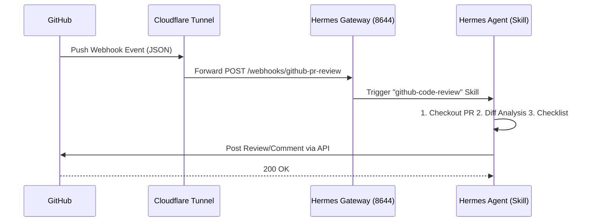

# Hermes Agent 自动化 PR 审查配置指南

本文档指导如何从零开始配置 Hermes Agent，使其能够在 GitHub 收到 Pull Request (PR) 时自动触发代码审查并发布结构化评论。

## 架构概览



---

## 前置准备

1.  **Hermes Agent**: 已安装并可正常运行。
2.  **GitHub CLI (`gh`)**: 已安装且已认证 (`gh auth login`)。
    *   *注意：认证时需授权 `repo` 和 `workflow` 权限。*
3.  **Skills**: 确保已安装 `github-code-review` 技能。
    ```bash
    npx skills add github/github-code-review -g -y
    ```

---

## 第 1 步：配置 Hermes Gateway

Gateway 充当本地接收 Webhook 的服务器。

### 1.1 修改配置
编辑 `~/.hermes/config.yaml`，启用 Webhook 平台：

```yaml
platforms:
  webhook:
    enabled: true
    extra:
      host: "0.0.0.0"
      port: 8644
      secret: "YOUR_HMAC_SECRET_HERE" # <--- 替换为你的强随机字符串
```

### 1.2 启动 Gateway
在后台运行 Gateway（建议使用 tmux 保持持久运行）：
```bash
hermes gateway run
```

验证状态：
```bash
curl http://localhost:8644/health
# 预期: {"status": "ok", "platform": "webhook"}
```

### 1.3 注册 Webhook 订阅
让 Gateway 知道如何处理收到的 `pull_request` 事件：

```bash
hermes webhook subscribe github-pr-review \
  --events "pull_request" \
  --prompt "New PR #{pull_request.number} {action}: {pull_request.title}..." \
  --skills "github-code-review" \
  --description "Automated code review" \
  --deliver origin
```

---

## 第 2 步：配置 Cloudflare Tunnel (内网穿透)

由于 Gateway 运行在内网，需要通过 Cloudflare Tunnel 暴露公网 URL。

### 2.1 安装 Cloudflared
```bash
mkdir -p ~/bin
curl -fsSL https://github.com/cloudflare/cloudflared/releases/latest/download/cloudflared-linux-amd64 -o ~/bin/cloudflared
chmod +x ~/bin/cloudflared
```

### 2.2 启动 Quick Tunnel (简易方案)
此方案无需 Cloudflare 账号，URL 每次重启会随机变化。

```bash
~/bin/cloudflared tunnel --url http://localhost:8644
```
**记录终端输出的 URL** (例如：`https://random-name.trycloudflare.com`)。

### 2.3 (可选) 使用 Named Tunnel (生产方案)
若需固定 URL，请使用 Cloudflare Dashboard 生成的 Token 启动：
```bash
~/bin/cloudflared tunnel --token <YOUR_TOKEN> run
```

---

## 第 3 步：配置 GitHub Webhook

将 GitHub 仓库的事件推送到我们的 Tunnel URL。

### 3.1 创建 Webhook
```bash
REPO="OWNER/REPO" # 替换为你的仓库名
TUNNEL_URL="https://random-name.trycloudflare.com" # 替换为第 2 步获取的 URL
SECRET="YOUR_HMAC_SECRET_HERE" # 必须与 config.yaml 中的 secret 一致

gh api repos/$REPO/hooks \
  --method POST \
  -f "active=true" \
  -f "events[]=pull_request" \
  -f "config[url]=$TUNNEL_URL/webhooks/github-pr-review" \
  -f "config[content_type]=json" \
  -f "config[secret]=$SECRET" \
  -f "config[insecure_ssl]=0"
```

### 3.2 验证
打开 GitHub 仓库 -> **Settings** -> **Webhooks**，确认新建的 Webhook 状态正常。

---

## 第 4 步：验证生效

Webhook 在 GitHub 页面显示绿勾只代表"事件已送达"，**不代表 Agent 真的会评审**。务必做一次端到端冒烟。

### 4.1 触发一次真实评审

开一个测试 PR（草稿 PR 即可）：

```bash
git checkout -b test/hermes-smoke
git commit --allow-empty -m "smoke: trigger hermes review"
git push -u origin test/hermes-smoke
gh pr create --base main --title "Hermes smoke test" --body "verify automated review"
```

### 4.2 预期结果

约 30–90 秒内（取决于 diff 大小与 LLM 延迟），PR 上应自动出现一条结构化评论。成功的评审长这样：

```
## PR Review — <PR 标题>

**Verdict: Reviewed 💬** (N critical, M warnings, K suggestions)

### 🔴 Critical / 必须修复
- **<文件>:<行>** — <问题描述>。Suggestion: <修复建议>

### ⚠️ Warning / 建议修改
- ...

### 💡 Suggestion / 仅供参考
- ...

### ✅ Looks Good
- ...

*Reviewed by Hermes Agent*
```

看到这条评论 = 全链路打通。

### 4.3 没出现评论怎么排查

按数据流顺序逐段查：

1. **Webhook 送达？** GitHub → Settings → Webhooks → Recent Deliveries，看最近一条 `pull_request` 事件的响应码（2xx 才算送达；401 见 FAQ）。
2. **Gateway 收到？** Gateway 终端日志应有 `POST /webhooks/github-pr-review` 记录。
3. **Tunnel 活着？** `curl <TUNNEL_URL>/health` 应返回 `{"status":"ok"}`；Quick Tunnel 重启会换 URL，见第 5 步。
4. **Skill 已装？** `npx skills list` 确认 `github-code-review` 在列。

清理：验证通过后关闭并删除测试 PR / 分支即可。

---

## 第 5 步：维护脚本 (针对 Quick Tunnel)

由于 Quick Tunnel 重启后 URL 会变，以下脚本可自动提取新 URL 并更新 GitHub Webhook。

保存为 `update_webhook.sh`:

```bash
#!/bin/bash
# 用法: ./update_webhook.sh <WEBHOOK_ID> <REPO> <SECRET>

WEBHOOK_ID=$1
REPO=$2
SECRET=$3

echo "Waiting for tunnel URL..."
sleep 10 # 等待 tunnel 启动并打印 URL

# 从日志中提取 URL (假设日志在 /tmp/cloudflared.log)
NEW_URL=$(grep -o "https://[^ ]*\.trycloudflare\.com" /tmp/cloudflared.log | tail -1)

if [ -n "$NEW_URL" ]; then
  echo "Updating GitHub Webhook to: $NEW_URL"
  
  gh api repos/$REPO/hooks/$WEBHOOK_ID \
    --method PATCH \
    -f "config[url]=$NEW_URL/webhooks/github-pr-review" \
    -f "config[secret]=$SECRET" \
    -f "config[content_type]=json" \
    -f "config[insecure_ssl]=0" > /dev/null
    
  echo "Done!"
else
  echo "Error: Could not find Tunnel URL"
  exit 1
fi
```

---

## 常见问题 (FAQ)

**Q: 为什么 GitHub Webhook 页面显示 "Invalid HTTP Response (401)"？**
A: GitHub 发送的 **Ping 测试请求** 签名格式可能与真实事件不同，导致 Gateway 校验失败。
*   **现象**: Ping 失败，但真实的 PR 事件能成功触发 Agent 审查。
*   **结论**: 只要真实 PR 能触发，可忽略此报错。

**Q: Cloudflare Dashboard 显示 Tunnel 状态为 "Down"？**
A: 如果你使用的是 Quick Tunnel，它不会出现在 Dashboard 中（因此显示 Named Tunnel 为 Down）。这是正常现象，Quick Tunnel 仅在终端运行期间有效。

**Q: Hermes 评审会阻塞 PR 合入吗？它和 CI 覆盖率门禁是什么关系？**
A: 不阻塞。Hermes 评审是**建议性软层** —— 只发结构化评论（甚至支持合入后再补 verdict），不设 required status check。真正卡合入的是另一套**硬门禁**：`.github/workflows/` 的 lint / 全局覆盖率 / patch coverage / 无回退四道闸，详见 [`ci-coverage-gates.md`](./ci-coverage-gates.md)。二者互补：硬门禁守机械底线，Hermes 补人类视角的设计与逻辑评审。

**Q: PR 推新 commit 后会重新评审吗？**
A: 会。`hermes webhook subscribe --events "pull_request"` 订阅的是整个 `pull_request` 事件族，其中 `opened`（首次开 PR）、`synchronize`（推新 commit）、`reopened`（重开）都会重新触发评审。若只想首次评审一次，可在 subscribe 时用更窄的 action 过滤，或在 skill prompt 里按 `{action}` 分支处理。
