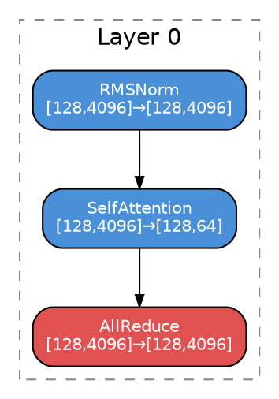

# Plan: Graphviz/DOT Export — Inference OpGraph + Training Graph

## Context

Neither the inference OpGraph nor the training Graph has a topology visualization today. ONNX (Netron) and Chrome Trace exist but require separate tools and don't show the training graph at all. A DOT export produces portable, diff-friendly `.dot` files that render to SVG/PDF via Graphviz — useful for understanding operator flow, reviewing parallelization transforms, inspecting PP stage assignment, and catching structural regressions.

Both inference and training paths share the same `OpGraph` IR (`python/zrt/ir/`). The training module's graph-native path (`modeller.py`, `TrainingFlopsPass`, `TrainingPipelinePass`) works directly on `OpGraph` instances (separate fwd and bwd graphs, or a stitched fwd+bwd graph). The `export_dot()` function therefore covers inference, training-forward, training-backward, and stitched training graphs uniformly — no separate training exporter needed. The spec-based formula path (`training/ir/training_graph.py::Graph`) is out of scope here.

---

## Acceptance Criteria

- `export_dot(graph, path)` writes a valid Graphviz DOT file for any `OpGraph` — inference (prefill/decode), training-forward, training-backward, or stitched fwd+bwd
- Nodes are grouped into `subgraph cluster_layer{N}` by `node.layer`
- Node fill color encodes `node.category`: compute=`#4A90D9` (blue), comm=`#E05252` (red), memory=`#E09A52` (orange)
- Node label = `{component or op_type}\n{input_shape} → {output_shape}` (first input/output shape only)
- Edges carry no labels (clean graph) but are directed (→)
- If `graphviz` CLI is installed, `render_dot(dot_path, format="svg")` auto-renders; silently skips otherwise
- DOT export is integrated into the existing `export_full_report()` path alongside ONNX/Excel (when `--hw` is provided)
- A standalone function `export_dot_only(graph, output_dir)` allows export without performance data
- Tests pass without `graphviz` installed (DOT syntax validation only)

---

## Implementation Steps

### 1. Create `python/zrt/report/dot_exporter.py` (new file)

```python
def export_dot(
    graph: OpGraph,
    output_path: Path,
    title: str = "",
) -> Path:
    """Write fused OpGraph to Graphviz DOT format."""
    ...

def render_dot(dot_path: Path, format: str = "svg") -> Path | None:
    """Render .dot to SVG/PDF via subprocess; returns None if graphviz absent."""
    ...
```

**DOT structure:**


**Color map** (constant in module):
```python
_CATEGORY_COLOR = {
    "compute":       "#4A90D9",
    "communication": "#E05252",
    "memory":        "#E09A52",
}
_DEFAULT_COLOR = "#AAAAAA"
```

**Node label** logic:
- Prefer `node.component` over `node.op_type` (more readable: "SelfAttention" vs "fused.SelfAttention")
- Append `\n{first_input_shape} → {first_output_shape}` when shapes are non-empty
- Escape backslashes and quotes for DOT string safety

**Cluster grouping:**
- Group by `node.layer` (string field on OpNode, e.g. `"0"`, `"1"`)
- Nodes with empty layer go into an ungrouped `cluster_other`
- Edges written after all clusters to avoid DOT rendering artifacts

**Render helper:**
```python
import shutil, subprocess

def render_dot(dot_path: Path, format: str = "svg") -> Path | None:
    if not shutil.which("dot"):
        return None
    out = dot_path.with_suffix(f".{format}")
    subprocess.run(["dot", f"-T{format}", str(dot_path), "-o", str(out)],
                   check=True, capture_output=True)
    return out
```

---

### 2. Integrate inference DOT into `python/zrt/report/onnx_exporter.py`

`export_all()` (line ~350) currently returns a dict of paths. Add DOT export alongside:

```python
from .dot_exporter import export_dot, render_dot

# inside export_all():
dot_path = export_dot(fused_graph, output_dir / f"{model_name}_{phase}_fused_graph.dot")
render_dot(dot_path)  # no-op if graphviz absent
paths["fused_dot"] = dot_path
```

---

### 3. Create `python/zrt/transform/debug_pass.py` — `GraphDumpPass`

A passthrough `GraphPass` that dumps the current graph state as DOT at any point in the pipeline. `TransformContext` has no `output_dir`, so path is given at construction time.

```python
from pathlib import Path
from python.zrt.transform.base import GraphPass
from python.zrt.report.dot_exporter import export_dot, render_dot

class GraphDumpPass(GraphPass):
    """Passthrough pass that snapshots the graph as a DOT file for debugging."""

    def __init__(self, label: str, output_dir: Path, render: bool = True):
        self._label = label
        self._output_dir = output_dir
        self._render = render

    @property
    def name(self) -> str:
        return f"dump_{self._label}"

    def run(self, graph: "OpGraph", ctx: "TransformContext") -> "OpGraph":
        path = self._output_dir / f"{self._label}.dot"
        export_dot(graph, path)
        if self._render:
            render_dot(path)   # no-op if graphviz absent
        return graph           # passthrough — no mutation
```

**What each dump point shows in the DOT** (mutations per stage):

| Insert after | Visible change in DOT |
|---|---|
| `TensorParallelPass` | Node tensor shapes scaled by 1/TP; `tp_split` annotation set |
| `CommInserterPass` | **New red `comm.*` nodes** (AllReduce, A2A, P2P) appear between compute nodes |
| `PipelineParallelPass` | Nodes carry `pp_stage` annotation; cluster labels can reflect stage |
| `FusionPass` | **Node count drops** — sequences merged via `replace_subgraph()` |
| `FlopsPass` | Nodes carry `flops`, `read_bytes`, `write_bytes` annotations |
| `RooflinePass` | Nodes carry `bound` (`compute`/`memory`) — exporter can show on label |
| `StreamAssignPass` | Nodes carry `stream_id`/`stream_type` — exporter can color by stream |

**Usage example** (inserted into `build_default_pipeline()` or caller):
```python
from python.zrt.transform.debug_pass import GraphDumpPass

pipe.add("split", TensorParallelPass(), condition=lambda c: c.parallel.tp > 1)
pipe.add("split", GraphDumpPass("after_tp", debug_dir))
pipe.add("split", CommInserterPass())
pipe.add("split", GraphDumpPass("after_comm", debug_dir))
pipe.add("fuse",  FusionPass())
pipe.add("fuse",  GraphDumpPass("after_fusion", debug_dir))
pipe.add("analyze", FlopsPass())
pipe.add("analyze", RooflinePass())
pipe.add("analyze", GraphDumpPass("after_roofline", debug_dir))
```

**Optional node label enrichment**: the DOT exporter's node label can optionally include `annotations.get("bound", "")` and `annotations.get("stream_id", "")` when present, so later dump points show richer per-node information without requiring a separate exporter mode.

---

### 4. Integrate into `python/zrt/graph/transform_runner.py`

`run_transform()` calls `export_transformed_graph()` from `transform/exporter.py`. After that call:

```python
from python.zrt.report.dot_exporter import export_dot, render_dot

dot_path = export_dot(transformed_graph, output_dir / f"{base_name}_transformed_graph.dot")
render_dot(dot_path)
```

---

### 4. Integrate training DOT into `python/zrt/transform/analysis/modeller.py`

`modeller.py:307-343` receives `forward_graph: OpGraph` and `backward_graph: OpGraph`. Export both after the pipeline metrics step:

```python
from python.zrt.report.dot_exporter import export_dot, render_dot

for phase_name, g in [("train_fwd", forward_graph), ("train_bwd", backward_graph)]:
    if g is not None:
        dot_path = export_dot(g, output_dir / f"{model_name}_{phase_name}.dot")
        render_dot(dot_path)
```

The `node.phase` field (set by `stitch_fwd_bwd()`) distinguishes fwd vs bwd nodes — the exporter can optionally add a phase prefix to cluster labels.

---

### 5. Update `python/zrt/report/__init__.py`

```python
from .dot_exporter import export_dot, render_dot
```

---

### 6. Add tests in `tests/test_dot_exporter.py` (new file)

```bash
PYTHONPATH=python pytest tests/test_dot_exporter.py -v 2>&1 | tail -n 20
```

**Inference OpGraph** (no graphviz required, fixture: `hf_models/llama3_8b`):
- `test_dot_valid_syntax` — regex-check output for `digraph`, `subgraph cluster_`, `->`
- `test_cluster_count_matches_layers` — cluster count == `len({n.layer for n in graph.nodes.values()})`
- `test_node_count_matches_graph` — DOT node IDs == `len(graph.nodes)`
- `test_category_colors` — compute nodes contain `#4A90D9`, comm nodes contain `#E05252`
- `test_empty_graph_no_crash` — empty OpGraph produces valid (empty) DOT

**Training OpGraph** (no graphviz, fixture: `hf_models/llama3_8b` with `--train`):
- `test_training_fwd_dot` — fwd OpGraph exports valid DOT with layer clusters
- `test_training_bwd_dot` — bwd OpGraph exports; comm nodes (all_reduce etc.) use red color

```python
from python.zrt.graph import run_trace_phases
result = run_trace_phases("hf_models/llama3_8b", num_layers=2, phases=("prefill",))
_, fused = result.graphs["prefill"]

result_train = run_trace_phases("hf_models/llama3_8b", num_layers=2,
                                phases=("train_forward", "train_backward"))
fwd_graph = result_train.graphs["train_forward"][1]
bwd_graph = result_train.graphs["train_backward"][1]
```

---

## Critical Files

| File | Action | Notes |
|------|--------|-------|
| `python/zrt/report/dot_exporter.py` | **Create** | `export_dot` + `render_dot`; handles any `OpGraph` phase |
| `python/zrt/transform/debug_pass.py` | **Create** | `GraphDumpPass` — passthrough DOT snapshot pass |
| `python/zrt/report/__init__.py` | Edit | Add `export_dot, render_dot` to exports |
| `python/zrt/report/onnx_exporter.py` | Edit | Call `export_dot` in `export_all()` |
| `python/zrt/graph/transform_runner.py` | Edit | Call `export_dot` after transform |
| `python/zrt/transform/analysis/modeller.py` | Edit | Call `export_dot` on fwd + bwd OpGraphs |
| `tests/test_dot_exporter.py` | **Create** | 7 test cases (5 inference + 2 training) + `GraphDumpPass` passthrough test |

## Reuse

- `node.layer`, `node.category`, `node.component`, `node.op_type` — existing OpNode fields, no IR changes needed
- `node.phase` — set by `stitch_fwd_bwd()` in `ir/adapter.py`; use to prefix fwd/bwd cluster labels
- `graph.topo_sort()` — deterministic node/edge order in DOT output
- `graph.edges` — iterate directly for edges
- Pattern from `onnx_exporter.py:export_all()` for return-dict integration

---

## Verification

```bash
# 1. Unit tests (no graphviz needed)
PYTHONPATH=python pytest tests/test_dot_exporter.py -v 2>&1 | tail -n 20

# 2. Inference DOT via CLI
python -m python.zrt --model-id hf_models/llama3_8b --layers 2
ls output/llama3_8b/  # *_fused_graph.dot present

# 3. If graphviz installed: render and open
dot -Tsvg output/llama3_8b/llama3_8b_prefill_fused_graph.dot -o /tmp/graph.svg

# 4. Transform runner DOT
python -m python.zrt --model-id hf_models/llama3_8b --layers 2 --hw nvidia_h100_sxm --tp 2
ls output/llama3_8b/  # *_transformed_graph.dot present

# 5. Training DOT via --train flag
python -m python.zrt --model-id hf_models/llama3_8b --layers 2 --train --hw nvidia_h100_sxm
ls output/llama3_8b/  # *_train_fwd.dot and *_train_bwd.dot present

# 6. Regression check
PYTHONPATH=python pytest tests/test_report_summary.py tests/test_transform.py -v 2>&1 | tail -n 30
```
