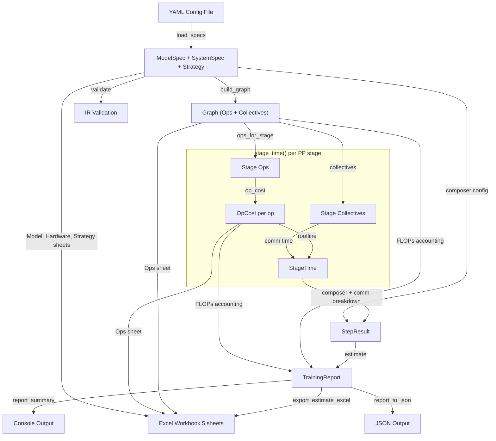
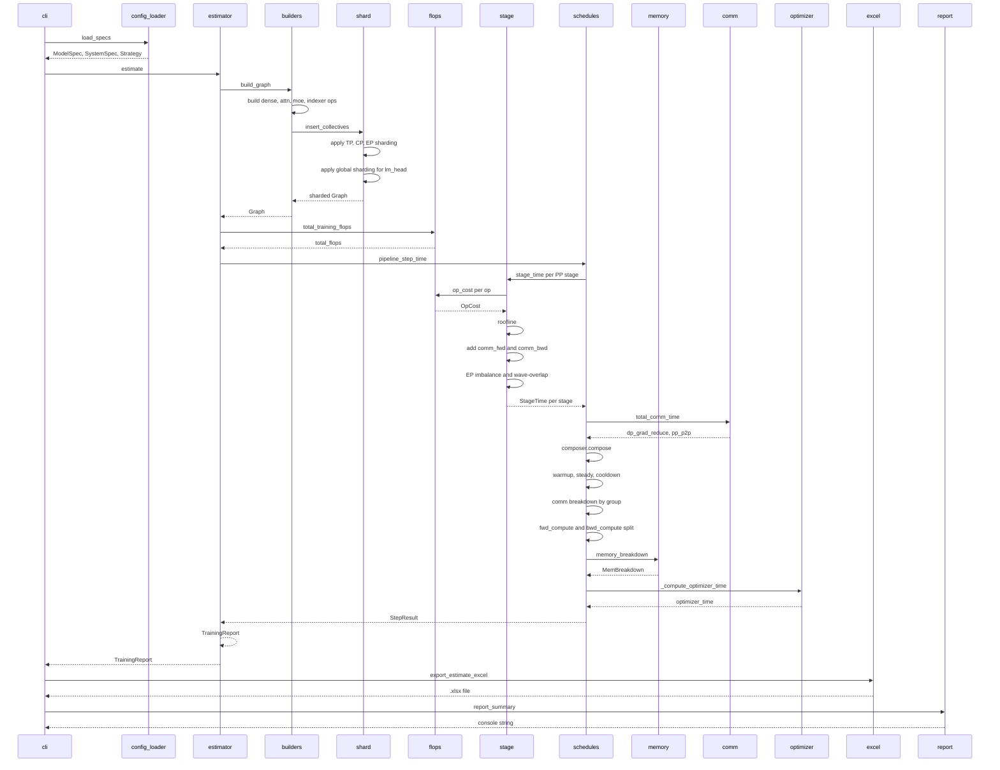
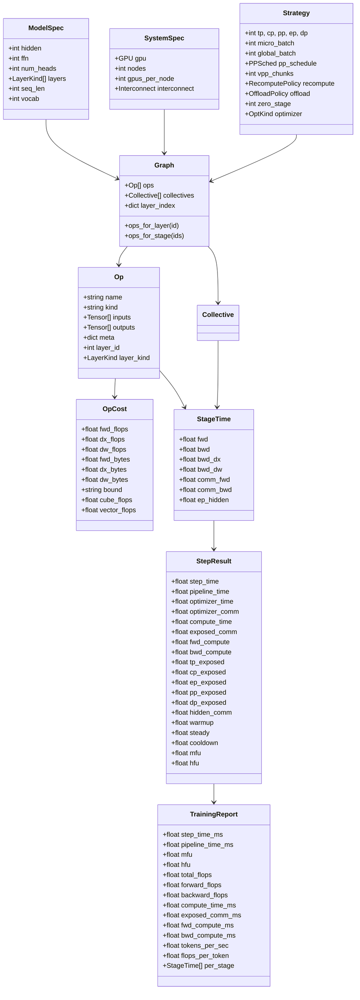

# ZRT Estimate 系统设计文档

> 训练性能估算流水线（Stack A: spec-based）架构与数据流。
> 代码路径：`python/zrt/training/`

## 1. 整体分层

```
python/zrt/training/
├── spec/          ← 数据契约层 (data contracts)
├── io/            ← 输入输出层 (config loader, excel exporter)
├── ir/            ← 中间表示层 (synthetic graph, sharding, collectives)
├── models/        ← 代价模型层 (flops, comm, memory, optimizer)
├── compose/       ← 时序组合层 (per-stage → pipeline schedule)
├── search/        ← 评估入口层 (single-point estimate, grid search)
└── trace/         ← 导出层 (timeline export)
```

## 2. 核心数据流



## 3. 调用链总览



## 4. Spec 层 — 数据契约

### 4.1 ModelSpec (`spec/model.py`)

模型架构的完整描述，包含 50+ 字段：

| 分类 | 关键字段 |
|------|---------|
| 核心几何 | `hidden`, `ffn`, `num_heads`, `num_kv_heads`, `head_dim`, `vocab`, `seq_len` |
| 层结构 | `layers: list[LayerKind]` — 如 `["dense"]*3 + ["moe"]*57 + ["mtp"]*1` |
| MLA (V3) | `q_lora_rank`, `kv_lora_rank`, `qk_nope_head_dim`, `qk_rope_head_dim`, `v_head_dim` |
| MoE | `num_experts`, `top_k`, `moe_ffn`, `n_shared_experts`, `capacity_factor`, `routed_expert_dtype` |
| V4 注意力 | `o_lora_rank`, `o_groups`, `compress_ratios`, `swa_window` |
| 压缩注意力 | `num_csa_layers`, `num_hca_layers`, `num_swa_only_layers` |
| Indexer | `index_n_heads`, `index_head_dim`, `index_topk` |
| MTP / HC | `mtp_depth`, `hc_mult`, `hc_sinkhorn_iters` |
| 数据类型 | `param_dtype`, `grad_dtype`, `master_dtype`, `act_dtype` |
| 归一化 | `norm_kind` (rmsnorm / layernorm) |

### 4.2 SystemSpec (`spec/system.py`)

硬件配置：

```python
@dataclass
class GPU:
    name: str                    # "NVIDIA H100 SXM"
    flops_bf16: float            # 统一峰值 TFLOPs (989.0)
    flops_fp8: float             # FP8 峰值
    hbm_gb: float                # HBM 容量 (80)
    hbm_bw_gbps: float           # HBM 带宽 (3350)
    # 异构核心
    cube_tflops: float | None    # Tensor/Cube 峰值 (989.0)
    vector_tflops: float | None  # Vector/Scalar 峰值 (66.9)
    overlap_ratio: dict          # op kind → Cube/Vector overlap 比例

@dataclass
class SystemSpec:
    gpu: GPU
    host_mem_gb: float
    interconnect: InterconnectSpec  # intra_node (NVLink) + inter_node (InfiniBand)
    nodes: int
    gpus_per_node: int

    @property
    def world_size(self) -> int:
        return self.nodes * self.gpus_per_node
```

### 4.3 Strategy (`spec/strategy.py`)

并行与训练策略：

```python
@dataclass
class Strategy:
    # 并行度
    tp: int = 1     # Tensor Parallelism
    cp: int = 1     # Context Parallelism (Sequence Parallelism)
    pp: int = 1     # Pipeline Parallelism
    ep: int = 1     # Expert Parallelism
    dp: int = 1     # Data Parallelism

    # Batch
    micro_batch: int = 1
    global_batch: int = 0       # 0 → derived from μbatch × dp × grad_accum

    # Pipeline
    pp_schedule: PPSched        # 1f1b / i1f1b / zb / dualpipe / dualpipev
    vpp_chunks: int = 1         # Virtual Pipeline Parallelism chunks

    # Context Parallelism
    cp_kind: CPKind             # none / ulysses / ring / hybrid / compressed

    # Memory
    zero_stage: int = 0         # 0/1/2/3 (3 = FSDP)
    recompute: RecomputePolicy  # per-layer recompute categories
    offload: OffloadPolicy      # CPU/NVMe offload

    # Overlap
    tp_overlap: TPOverlap       # none / coc / mc2
    ep_overlap: bool            # EP A2A wave overlap with GEMM
    dualbatch: bool             # Dual-batch overlap
    dp_overlap_in_bubble: bool  # DP AR hidden in pipeline bubble

    # Optimizer
    optimizer: OptKind          # adam / muon
    muon_config: MuonConfig | None
```

**约束关系：** `TP × CP × PP × DP = world_size`（EP 在 rank 内部处理，不占用额外 rank）。

## 5. IR 层 — 合成计算图

### 5.1 数据结构 (`ir/training_graph.py`)

```python
@dataclass
class Tensor:
    name: str
    shape_logical: tuple[int, ...]  # 切分前的全局形状
    shape_local: tuple[int, ...]    # 切分后 per-rank 形状
    dtype: Dtype
    is_activation: bool
    is_param: bool = False

    def num_elements(self) -> int:  # 从 shape_local 计算
    def nbytes(self) -> int:        # num_elements × dtype.bytes

@dataclass
class Op:
    name: str                    # "L0.q_a_proj", "L3.attn_core"
    kind: str                    # "matmul" | "attn_core" | "sparse_attn" | ...
    inputs: list[Tensor] = []
    outputs: list[Tensor] = []
    meta: dict[str, Any] = {}    # {m, n, k, heads, head_dim, ...}
    layer_id: int = -1           # -1 表示全局 op (lm_head, embed)
    layer_kind: LayerKind = DENSE  # dense / moe / mtp

@dataclass
class Collective:
    name: str                    # "tp_rs_after_q_a"
    kind: str                    # "AG" | "RS" | "AR" | "A2A" | "P2P"
    group: str                   # "TP" | "CP" | "EP" | "DP" | "PP"
    bytes_: int                  # per-rank payload bytes
    inserted_after: str | None   # 关联的 Op name (之后)
    inserted_before: str | None  # 关联的 Op name (之前)
    rounds: int = 1              # Ring CP 的轮数
    overlap: bool = False        # 是否与计算重叠
    phase: str = "fwd"           # "fwd" | "bwd" | "both"

@dataclass
class Graph:
    ops: list[Op] = []
    collectives: list[Collective] = []
    layer_index: dict[int, tuple[int, int]] = {}  # layer_id → (start, end) in ops[]

    def ops_for_layer(self, layer_id: int) -> list[Op]
    def ops_for_stage(self, stage_layer_ids: list[int]) -> list[Op]
```

### 5.2 Graph 构建 (`ir/builders.py`)

从 ModelSpec 合成 IR graph，按 layer 依次构建：

```
build_graph(model, strategy)
│
├── Layer 0 (Dense):
│   ├── embed lookup
│   ├── _build_attn_ops() → q_a_proj, q_b_proj, kv_a_proj, kv_b_proj,
│   │                       attn_core, o_proj, + v4 variants (wq_a/wq_b, wo_a/wo_b)
│   ├── _build_dense_ffn() → up_proj, gate_proj, down_proj, swiglu
│   ├── norms (pre_attn_ln, post_attn_ln, pre_ffn_ln, post_ffn_ln)
│   └── residual adds, rope
│
├── Layer 3 (MoE):
│   ├── same attn ops as Dense
│   ├── _build_moe_ops() → router, routed_expert_ffn (fused up/gate/down × topk)
│   │                      + shared_up_proj, shared_gate_proj, shared_down_proj
│   ├── mhc_pre, mhc_post (Hyper-Connections)
│   └── norms, residual adds
│
├── Indexer Layers (every 4 layers):
│   ├── idx_score_topk (einsum scoring)
│   ├── idx_comp_pool (KV compressor)
│   └── idx_wq_b, idx_weights, idx_comp_wkv, idx_comp_wgate
│
├── Global ops (layer_id = -1):
│   └── lm_head (matmul: seq × hidden → vocab)
│
└── MTP Layers (if mtp_depth > 0):
    └── mtp_embed_proj, mtp_attn, mtp_ffn
```

### 5.3 并行切分与通信插入 (`ir/shard.py`)

`insert_collectives(graph, model, strategy)` 在 graph 上原位修改：

```mermaid
flowchart TD
    subgraph TP["TP Sharding"]
        A["_apply_tp_sharding"] --> A1["heads / tp"]
        A --> A2["ih / tp for matmul k/n"]
        A --> A3["lm_head vocab / tp"]
        A --> A4["Insert RS after down_proj"]
        A --> A5["Insert AG after up_proj"]
    end

    subgraph CP["CP Sharding"]
        B["_apply_cp_sharding"] --> B1["seq / cp"]
        B --> B2["indexer_topk s / cp"]
        B --> B3["Insert A2A around attn"]
    end

    subgraph EP["EP Sharding"]
        C["_insert_ep_collectives"] --> C1["dispatch A2A before expert_ffn"]
        C --> C2["combine A2A after expert_ffn"]
        C --> C3["message bytes / EP"]
    end

    subgraph GS["Global Sharding"]
        D["_apply_global_sharding"] --> D1["Find layer_id less than 0 ops"]
        D --> D2["Apply TP and CP to lm_head"]
    end

    A & B & C & D --> E["Sharded Graph with Collectives"]
```



**⚠️ 重要：** `build_graph()` 内部已调用 `insert_collectives()`，外部不要重复调用，否则会导致 double sharding。

## 6. Models 层 — 代价模型

### 6.1 OpCost 设计 (`models/flops.py`)

```python
@dataclass
class OpCost:
    # 计算量 FLOPs — 按反向传播阶段拆分
    fwd_flops: float = 0.0   # 前向传播
    dx_flops: float = 0.0    # dX: 对输入求梯度
    dw_flops: float = 0.0    # dW: 对权重求梯度

    # 访存量 Bytes — 与 FLOPs 三阶段对应
    fwd_bytes: float = 0.0
    dx_bytes: float = 0.0
    dw_bytes: float = 0.0

    # Bound: 仅用于 MFU accounting filter (不影响 timing)
    bound: str = "compute"   # "compute" | "memory"

    # 异构计算 FLOPs (Cube/Vector) — H100 专用
    fwd_cube_flops: float = 0.0
    fwd_vector_flops: float = 0.0
    dx_cube_flops: float = 0.0
    dx_vector_flops: float = 0.0
    dw_cube_flops: float = 0.0
    dw_vector_flops: float = 0.0
```

**字段关系：**
- `fwd/dx/dw` 三阶段 **互补不重复**：`total = fwd + dx + dw`
- `cube/vector` 是 `fwd` 的**异构拆分**：对 matmul 是 `cube=fwd, vector=0`；对 attn 是 `cube+vector > fwd`
- `bytes` 与 `flops` **正交**：roofline 模型的两个独立维度

**典型倍数关系：**

| Op kind | dx/fwd | dw/fwd | 原因 |
|---------|--------|--------|------|
| matmul | 1.0x | 1.0x | dX 和 dW 与 fwd 计算量相同 |
| attn_core | 2.5x | 0.0x | Flash Attention 内部 recompute，无权重 |
| elementwise | 2.5x | 0.0x | 经验值（激活函数导数等） |
| indexer_topk | 2.0x | 0.0x | 只算 idx_q 梯度 |
| embed | 0.0x | 0.0x | gather 操作，零 FLOPs |

### 6.2 Roofline 时序模型 (`compose/stage.py`)

```python
# 统一峰值路径 (无异构配置时)
compute_t = flops / (peak_flops × efficiency)
memory_t  = bytes / (hbm_bandwidth × efficiency)
op_time   = max(compute_t, memory_t)

# 异构路径 (H100: Cube + Vector)
cube_t   = cube_flops / (cube_peak × efficiency)
vector_t = vector_flops / (vector_peak × efficiency)
compute_t = max(cube_t, vector_t) + (1 - overlap) × min(cube_t, vector_t)
op_time   = max(compute_t, memory_t)
```

**Heterogeneous fallback guard (`_cost_phase_time`):**

```python
if has_heterogeneous_compute(system):
    cube = cost.{phase}_cube_flops
    vector = cost.{phase}_vector_flops
    if cube > 0 or vector > 0:      # ← 有异构建模才走异构路径
        return op_to_time_hetero(cube, vector, bytes_, ...)
# fallback: cube/vector 都为 0 → 走统一峰值路径
return op_to_time(flops, bytes_, ...)
```

### 6.3 通信模型 (`models/comm.py`)

```python
def total_comm_time(graph, model, system, strategy) -> dict[str, float]:
    """返回各类通信的总时间:
    {
        "dp_grad_reduce": ...,   # DP gradient all-reduce (考虑 EP sharding)
        "pp_p2p": ...,           # PP point-to-point per microbatch
        "ep_dispatch": ...,      # EP dispatch A2A
        "ep_combine": ...,       # EP combine A2A
        ...
    }
    """
```

**DP gradient reduce 关键修正（已知 bug 已修复）：**
- `_params_on_rank_for_dp()` 正确应用 EP sharding：routed expert params ÷ EP
- 修复前：41.95B params → 修复后：0.76B params（55× overestimate 已消除）

### 6.4 显存模型 (`models/memory.py`)

```python
def memory_breakdown(graph, model, system, strategy) -> MemBreakdown:
    """返回 per-rank 显存分解:
    MemBreakdown(
        weights_gb=...,       # TP/EP sharded
        grads_gb=...,         # ZeRO sharded
        opt_state_gb=...,     # Adam: 2× grads; Muon: varies
        activations_gb=...,   # depends on recompute policy
        comm_buffers_gb=...,  # max tensor size being communicated
        total_gb=...
    )
    """
```

### 6.5 优化器模型 (`models/optimizer.py`)

```python
def adam_step_flops(params_on_rank: int) -> float:
    return 8 * params_on_rank  # m + v update + momentum + step

def muon_optimizer_step_flops(params, K, hidden, f_muon) -> float:
    """Newton-Schulz iteration based optimizer"""
```

**已知 bug：** `_compute_optimizer_time()` 在 `schedules.py` 中仍使用 `model.total_params()` 未应用 EP sharding — 对 MoE 模型有 overestimate。

## 7. Compose 层 — 时序组合

### 7.1 Per-Stage 时序 (`compose/stage.py`)

```python
def stage_time(stage_ops, stage_collectives, model, system, strategy) -> StageTime:
    """计算一个 PP stage + 一个 microbatch 的 fwd + bwd 时间"""

    # 1. 逐 op 计算 compute time
    for op in stage_ops:
        cost = op_cost(op, model)
        fwd_t = _cost_phase_time(cost, "fwd", ...)
        dx_t  = _cost_phase_time(cost, "dx",  ...)
        dw_t  = _cost_phase_time(cost, "dw",  ...)
        t_fwd    += fwd_t
        t_bwd_dx += dx_t
        t_bwd_dw += dw_t

    # 2. Activation recompute (如果配置了)
    t_bwd_dx += _recompute_time(stage_ops, ...)

    # 3. Communication (TP/CP/EP) 嵌入 fwd/bwd
    t_fwd    += t_comm_fwd   # after TP overlap reduction
    t_bwd_dx += t_comm_bwd

    # 4. EP load imbalance (只影响 routed expert 部分)
    t_fwd = t_fwd * (1-ep_frac) + t_fwd * ep_frac * imbalance

    # 5. EP wave-overlap (A2A 与 GEMM 重叠)
    t_fwd    -= saved_fwd    # 被 wave overlap 隐藏的 EP A2A
    t_bwd_dx -= saved_bwd
    ep_hidden = saved_fwd + saved_bwd

    return StageTime(fwd=t_fwd, bwd=t_bwd_dx+t_bwd_dw, ...)
```

**StageTime 输出：**

```python
@dataclass
class StageTime:
    fwd: float = 0.0          # 前向总时间 (含嵌入的 comm)
    bwd: float = 0.0          # 反向总时间 = bwd_dx + bwd_dw
    bwd_dx: float = 0.0       # 激活梯度 (含嵌入的 comm)
    bwd_dw: float = 0.0       # 权重梯度
    comm_fwd: float = 0.0     # fwd 中的暴露通信 (after overlap reduction)
    comm_bwd: float = 0.0     # bwd 中的暴露通信
    ep_hidden: float = 0.0    # EP wave overlap 隐藏的通信
```

### 7.2 Pipeline Schedule (`compose/schedules.py`)


**Pipeline 公式：**

| Schedule | Warmup | Steady | Cooldown | 特点 |
|----------|--------|--------|----------|------|
| 1F1B | `(pp-1) × max(fwd)` | `M × max(fwd+bwd)` | `(pp-1) × max(bwd)` | 基础调度 |
| VPP/i1f1B | warmup ÷ V | same | cooldown ÷ V | Virtual stages |
| DualPipe | bubble ÷ 4 | `M × t_stage` | bubble ÷ 4 | F/B parallel |
| ZeroBubble | `(pp-1) × max(t_stage - t_w)` | same | same | dW delay fills bubble |

**StepResult 关键字段：**

```python
@dataclass
class StepResult:
    # 核心时序
    step_time: float          # 总 step 时间
    pipeline_time: float      # = step_time - optimizer_time - optimizer_comm
    optimizer_time: float
    optimizer_comm: float

    # Pipeline 结构
    bubble_fraction: float
    warmup: float             # warmup phase 总时间
    steady: float             # steady phase 总时间
    cooldown: float           # cooldown phase 总时间
    dp_exposed: float         # DP AR on critical path
    schedule_name: str

    # 计算/通信分解
    compute_time: float       # 纯计算时间
    fwd_compute: float        # 前向纯计算
    bwd_compute: float        # 反向纯计算
    exposed_comm: float       # 关键路径上的通信

    # 分组暴露通信 (Σ = exposed_comm)
    tp_exposed: float         # TP RS/AG (after CoC/MC2)
    cp_exposed: float         # CP A2A
    ep_exposed: float         # EP A2A (after wave-overlap)
    pp_exposed: float         # PP P2P
    dp_exposed: float         # DP AR/RS

    # 隐藏通信 (不在关键路径)
    hidden_comm: float        # = dp_hidden + tp_hidden + ep_hidden
    dp_hidden: float          # DP AR absorbed in bubble
    tp_hidden: float          # TP hidden by CoC/MC2
    ep_hidden: float          # EP hidden by wave-overlap
```

**不变量：**
```
step_time        = pipeline_time + optimizer_time + optimizer_comm
pipeline_time    = compute_time + exposed_comm
exposed_comm     = tp_exposed + cp_exposed + ep_exposed + pp_exposed + dp_exposed
hidden_comm      = dp_hidden + tp_hidden + ep_hidden
total_comm_volume = exposed_comm + hidden_comm
```

### 7.3 Fwd/Bwd Compute 拆分

`pipeline_step_time()` 中新增的拆分逻辑：

```python
# 从 bottleneck stage 的 pure compute 比例拆分
fwd_compute_per_mb = max(0.0, s_bot.fwd - s_bot.comm_fwd)
bwd_compute_per_mb = max(0.0, s_bot.bwd - s_bot.comm_bwd)
compute_per_mb = fwd_compute_per_mb + bwd_compute_per_mb

if compute_per_mb > 0:
    fwd_ratio = fwd_compute_per_mb / compute_per_mb
    step.fwd_compute = step.compute_time * fwd_ratio
    step.bwd_compute = step.compute_time * (1.0 - fwd_ratio)
```

**实测 BWD/FWD 比例（V3.2, seq=128k, 8192 卡）：**
- FWD compute: 3644.87 ms (31.9%)
- BWD compute: 7546.25 ms (66.1%)
- **BWD/FWD = 2.07x** — 正常值，无重复计算

### 7.4 MFU/HFU 计算

```python
# MFU (不含 recompute)
mfu = (total_training_flops(graph) / pp) / (per_gpu_peak × step_time)

# HFU (含 recompute)
hfu = (total_training_flops(graph) + recompute_overhead_flops(graph)) / (pp × per_gpu_peak × step_time)
```

**关键修正（已知 bug 已修复）：**
1. ✅ 使用 `total_training_flops(graph)` 替代 6P rule（6P 对 V4 MoE 高估 30×）
2. ✅ 分母用 `per_gpu_peak` 而非 `per_gpu_peak × world_size`
3. ✅ 分子除以 `pp`（graph 覆盖所有层，但每 GPU 只处理 1/pp）
4. ✅ `total_training_flops()` 只计 compute-bound ops（排除 norm/swiglu/rope）

## 8. Search 层 — 评估入口

### 8.1 单点评估 (`search/estimator.py`)

```python
def estimate(model, system, strategy, graph=None) -> TrainingReport:
    """单配置评估入口"""
    # 1. 验证
    strategy.validate(model, system)
    warnings = ir_validate(model, system, strategy)

    # 2. 构建或复用 graph
    if graph is None:
        graph = build_graph(model, strategy)

    # 3. FLOPs 统计
    total_flops = total_training_flops(graph, model, strategy)
    fwd_flops, bwd_flops = forward_backward_flops(graph, model, strategy)

    # 4. Pipeline step time
    step_result = pipeline_step_time(graph, model, system, strategy)

    # 5. 派生指标
    tokens = global_batch × seq_len
    tokens_per_sec = tokens / step_result.pipeline_time
    flops_per_token = total_flops / tokens

    # 6. 组装报告
    return TrainingReport(
        step_time_ms=step_result.step_time * 1000,
        pipeline_time_ms=step_result.pipeline_time * 1000,
        mfu=step_result.mfu,
        hfu=step_result.hfu,
        memory=step_result.memory,
        total_flops=total_flops,
        forward_flops=fwd_flops,
        backward_flops=bwd_flops,
        # ... 40+ 字段
    )
```

### 8.2 Grid Search (`search/estimator.py`)

```python
def grid_search(model, system, space: SearchSpace) -> list[TrainingReport]:
    """遍历 SearchSpace 中的所有并行配置"""
    strategies = space.strategies(system.world_size)
    reports = []
    for strategy in strategies:
        try:
            strategy.validate(model, system)
            report = estimate(model, system, strategy)
            if report.memory.total / 1e9 <= space.max_memory_gb:
                reports.append(report)
        except (ValueError, Exception):
            continue
    reports.sort(key=lambda r: r.step_time_ms)
    return reports
```

### 8.3 报告格式 (`search/report.py`, `spec/report.py`)

| 输出 | 函数 | 内容 |
|------|------|------|
| Console | `report_summary()` | 分层 breakdown 表格（Step Time, Comm, Memory） |
| JSON | `report_to_dict()` | 所有字段序列化，fwd/bwd_compute_ms 包含 |
| Excel | `export_estimate_excel()` | 5-sheet workbook (Summary, Ops, Model, Hardware, Strategy) |

**Console Step Time Breakdown 格式：**

```
  Step Time Breakdown:
  Component                               Time (ms)        %
  ────────────────────────────────────── ────────── ────────
  Forward Compute                         165352.74    28.7%
  Backward Compute                        365917.38    63.5%
  Communication (exposed)                  44984.19     7.8%
    TP (RS/AG)                             35093.13     6.1%
    EP (A2A)                                8682.75     1.5%
    PP (P2P)                                1208.32     0.2%
  Optimizer (compute)                          0.60     0.0%
  ────────────────────────────────────── ────────── ────────
  TOTAL STEP TIME                         576254.91   100.0%
```

## 9. 数据流类图



## 10. 文件职责速查

| 文件 | 职责 | 输入 | 输出 |
|------|------|------|------|
| `io/config_loader.py` | YAML → 三个 Spec | YAML 文件 | ModelSpec, SystemSpec, Strategy |
| `ir/builders.py` | 合成计算图 | ModelSpec, Strategy | Graph(ops, collectives) |
| `ir/shard.py` | 并行切分 + 通信插入 | Graph, Strategy | 修改后的 Graph |
| `ir/training_graph.py` | 数据结构定义 | — | Tensor, Op, Collective, Graph |
| `ir/validate.py` | IR 合法性检查 | ModelSpec, SystemSpec, Strategy | warnings |
| `models/flops.py` | 逐 op FLOPs/bytes 代价 | Op, ModelSpec | OpCost |
| `models/comm.py` | 通信延迟模型 | Collective, Strategy, System | dict[name, time] |
| `models/memory.py` | 显存分解 | Graph, ModelSpec, Strategy | MemBreakdown |
| `models/optimizer.py` | 优化器 FLOPs | params count | optimizer FLOPs |
| `compose/stage.py` | 单 stage 时序 | stage ops, collectives, specs | StageTime |
| `compose/schedules.py` | Pipeline step 时序 | stage_times, specs | StepResult |
| `search/estimator.py` | 单点评估入口 | ModelSpec, SystemSpec, Strategy | TrainingReport |
| `search/report.py` | 报告格式化 | TrainingReport | JSON / console string |
| `io/excel_exporter.py` | Excel 导出 | TrainingReport, Graph, op_costs | .xlsx 文件 |
| `io/perf_tables.py` | 效率曲线查找 | GPU name, dtype, flops/bytes | efficiency ratio |
| `search/space.py` | 搜索空间枚举 | world_size constraints | Strategy list |
| `spec/model.py` | ModelSpec 定义 | — | ModelSpec, LayerKind |
| `spec/system.py` | SystemSpec 定义 | — | SystemSpec, GPU |
| `spec/strategy.py` | Strategy 定义 | — | Strategy, PPSched, etc. |
| `spec/report.py` | TrainingReport 定义 | — | TrainingReport |
| `spec/dtype.py` | Dtype 枚举 | — | Dtype (bf16/fp32/fp8/fp4) |

## 11. 已知 Bug 清单

| # | 文件 | 问题 | 状态 |
|---|------|------|------|
| 1 | `schedules.py:_compute_optimizer_time()` | 忽略 EP sharding — MoE 模型 optimizer FLOPs 高估 | 未修复 |
| 2 | `flops.py:_indexer_topk_cost()` | `kv_len = seq//4` 应为 `seq` — FLOPs 低估 4× | 未修复 |
| 3 | `flops.py:_indexer_topk_cost()` | `dx_flops=2×fwd` 只计 idx_q 梯度，缺 idx_kv | 待验证 |
| 4 | `schedules.py:tokens_per_sec` | 分母用 `step_time`（含 optimizer）→ 略低估 | 已修复 → `pipeline_time` |

## 12. CLI 使用方式

```bash
cd /mnt/d/workspace/claude/modeling

# 单配置评估
PYTHONPATH=python:. python -m python.zrt \
    --estimate-config python/zrt/training/configs/deepseek_v3_2_3d_h100.yaml

# 输出
# Console: Training Estimation Report (含 step time breakdown)
# Excel:   output/estimate/deepseek_v3_2_3d_h100_<timestamp>.xlsx (5 sheets)
```

## 13. 设计原则

1. **Spec-based synthesis**：不依赖真实 torch trace，从 spec 合成 IR graph，速度快、可解释
2. **Roofline timing**：`max(compute_t, memory_t)` — 始终取瓶颈
3. **Phase-aware backward**：dx 和 dw 分离，支持 ZeroBubble 等精细调度
4. **Heterogeneous compute**：H100 Cube/Vector 双峰值，fallback 到统一峰值
5. **Invariant-preserving**：StepResult 的 timing 分解有严格代数不变量，可在 pipeline_step_time() 中验证
