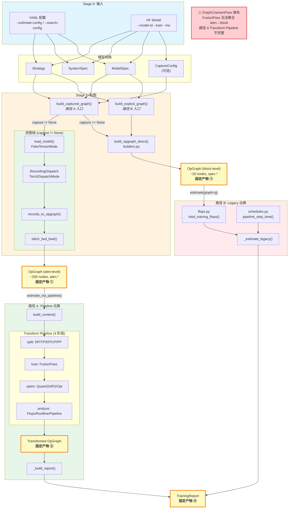
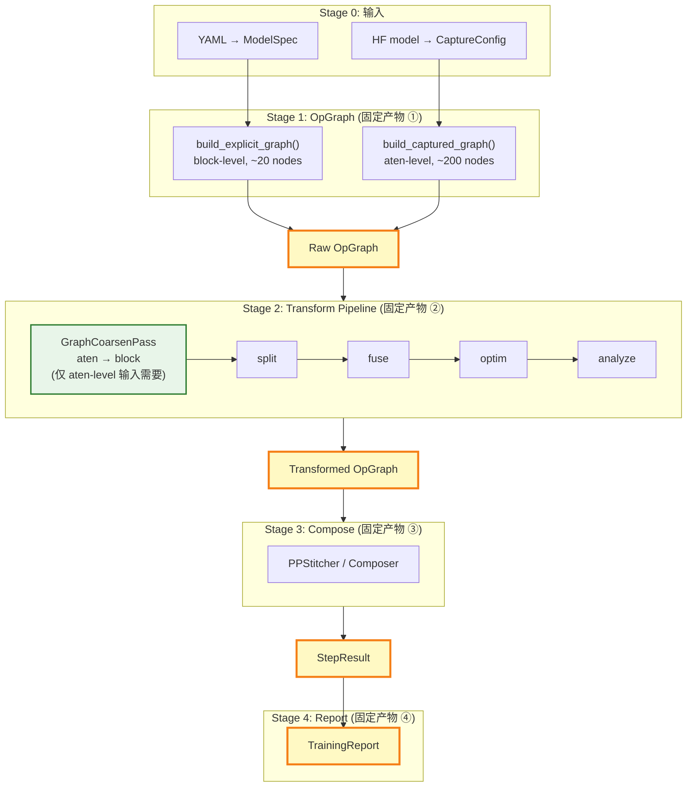
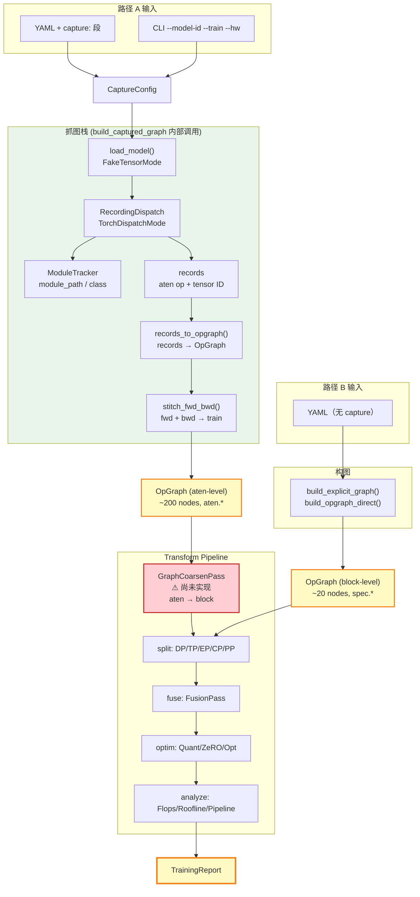

# 架构归一化重构方案

## 1. 现状分析

### 1.1 两套实现路径

| 维度 | 路径 B — 配置建模 (explicit_graph) | 路径 A — 抓图建模 (captured_graph) |
|------|----------------------------------|-----------------------------------|
| **入口** | `--estimate-config <yaml>` / `--search-config <yaml>` | `--model-id <id> --train --hw <hw>` |
| **模型来源** | YAML → `ModelSpec` | HF model → FakeTensorMode 抓图 |
| **构图函数** | `build_explicit_graph()` | `build_captured_graph()` |
| **IR** | `training/ir/training_graph.py` (`Graph`/`Op`/`Tensor`) | `ir/graph.py` (`OpGraph`/`OpNode`/`Edge`) |
| **Op 构建** | `training/ir/builders.py` (手工构造) | `graph/dispatch.py` (运行时抓取) |
| **FLOPs** | `training/models/flops.py` | `transform/analysis/training.py::TrainingFlopsPass` |
| **Memory** | `training/models/memory.py` | `transform/analysis/training.py::TrainingMemoryPass` |
| **Pipeline** | `training/compose/schedules.py::pipeline_step_time()` | `transform/analysis/training.py::TrainingPipelinePass` |
| **导入约定** | `zrt.*` (需 PYTHONPATH=python) | `python.zrt.*` |

### 1.2 重复点清单

| # | 重复模块 | Stack A 位置 | Stack B 位置 | 影响 |
|---|---------|-------------|-------------|------|
| D1 | IR 数据结构 | `training/ir/training_graph.py` (Graph/Op/Tensor/Collective) | `ir/graph.py` (OpGraph/OpNode/Edge/TensorMeta) | 两套 IR 无法互通，下游代码分叉 |
| D2 | Op 构建器 | `training/ir/builders.py` (dense_block/moe_block) | `graph/dispatch.py` + `ir/adapter.py` | 同一模型两种 op 列表，维护成本高 |
| D3 | FLOPs 计算 | `training/models/flops.py::op_cost()` | `transform/analysis/passes.py::FlopsPass` + `TrainingFlopsPass` | 公式重复，容易不一致 |
| D4 | Memory 估算 | `training/models/memory.py::memory_breakdown()` | `transform/analysis/training.py::TrainingMemoryPass` | ZeRO/activation 逻辑重复 |
| D5 | Pipeline 调度 | `training/compose/schedules.py::pipeline_step_time()` | `transform/analysis/training.py::TrainingPipelinePass` | 两套调度逻辑，composer 调用方式不同 |
| D6 | 通信建模 | `training/models/comm.py` | `transform/analysis/comm_latency.py::CommLatencyPass` | 通信延迟公式重复 |

### 1.3 已共享的部分（不动）

- `TrainingReport` (`training/spec/report.py`) — 两条路径已统一输出
- `StepResult` (`training/compose/schedules.py`) — 两条路径已共用
- PP Composers (`OneF1BComposer`, `Interleaved1F1BComposer`, etc.) — 两条路径已共用
- `training/spec/` 下的 `ModelSpec`, `Strategy`, `SystemSpec` — Stack A 专用，保留

---

## 2. 目标架构

### 2.1 核心原则

1. **OpGraph 为唯一 IR** — 废弃 `training/ir/training_graph.py` 的 `Graph`/`Op`/`Tensor`，所有路径统一产出 `OpGraph`
2. **阶段性产物固定** — 每个阶段输出明确的中间产物，两条路径在固定产物点汇合
3. **Transform Pipeline 为唯一分析通道** — Stack A 也走 Transform Pipeline，不再独立计算

### 2.2 当前双路径架构图

当前系统有两条独立的训练估算路径：

- **路径 B（配置建模）**：YAML → ModelSpec → `build_explicit_graph()` → block-level OpGraph → Legacy 手工成本模型
- **路径 A（抓图建模）**：HF Model → `build_captured_graph()` → 抓图栈 → aten-level OpGraph → Transform Pipeline

两条路径在 Stage 1（OpGraph 产物）之后分叉，各自独立计算 FLOPs/Memory/Pipeline，最终在 Stage 4（TrainingReport）汇合。

**关键差异**：路径 B 产出 block-level OpGraph（~20 个高层节点，`spec.*` op_type），路径 A 产出 aten-level OpGraph（~200 个细粒度节点，`aten.*` op_type）。Transform Pipeline 的 Pass 设计假设 block-level 输入，因此路径 A 的 aten-level OpGraph 需要经过 **GraphCoarsenPass**（尚未实现）聚合后才能正确走通 Transform Pipeline。



**已知限制**：
- GraphCoarsenPass 缺失（C6 验证）：FusionPass 无法自动聚合 aten→block，路径 A 的 Transform Pipeline 不完整
- 路径 B 仍走 Legacy 估算（`_estimate_legacy`），未迁移到 Transform Pipeline

### 2.3 目标归一化流程图

归一化后，两条路径在 Stage 1（OpGraph）汇合，统一走 Transform Pipeline：

- **GraphCoarsenPass**（新增）：将 aten-level OpGraph 按 `module_path` 聚合为 block-level OpNode，使路径 A 的抓图输出能正确走通 Transform Pipeline。对 block-level 输入（路径 B）为 no-op。
- **路径 B 迁移**：`_estimate_legacy` 废弃，路径 B 也走 `estimate_via_pipeline()`



### 2.4 固定产物定义

| 阶段 | 产物 | 类型 | 说明 |
|------|------|------|------|
| ① | Raw OpGraph | `ir.graph.OpGraph` | 未变换的原始计算图，包含 fwd/bwd 节点 |
| ② | Transformed OpGraph | `ir.graph.OpGraph` | 经过 split/fuse/optim/analyze 的变换后图 |
| ③ | StepResult | `training.compose.schedules.StepResult` | PP 调度后的步进时间分解 |
| ④ | TrainingReport | `training.spec.report.TrainingReport` | 最终性能报告 |

---

## 3. 分步重构计划

### Phase 1: Stack A 主入口切换到 OpGraph（消除 D1 + D2）

**目标**: Stack A 的 `estimate()` 入口使用 `build_opgraph()` 产出 OpGraph，下游消费者（`flops.py`、`schedules.py`）能直接消费 OpGraph。

**设计原则**: 以抓图路径（Stack B）为主路径，Stack A 作为分支在 Stage 1（OpGraph 产物）汇入主路径。

#### 3.1.1 已完成的基础设施（Phase B2 遗留）

| 组件 | 文件 | 状态 |
|------|------|------|
| `build_opgraph_direct()` | `training/ir/builders.py:1164` | ✅ 直接产出 OpGraph，不经过旧 IR |
| `build_explicit_graph()` | `training/ir/opgraph_builder.py` | ✅ 路径 B 构图入口（配置建模，原 `build_opgraph`） |
| `build_captured_graph()` | `training/ir/opgraph_builder.py` | ✅ 路径 A 构图入口（抓图建模，Pipeline 路径） |
| `insert_collectives_opgraph()` | `training/ir/shard.py` | ✅ OpGraph-native 分片 |
| `insert_cast_pass_opgraph()` | `training/ir/cast_pass.py` | ✅ OpGraph-native cast 插入 |
| `pipeline_step_time()` | `training/compose/schedules.py:744` | ✅ 已接受 OpGraph（鸭子类型） |
| `Op` → `OpNode` 映射 | `builders.py::_op_to_opnode()` | ✅ 含 `_KIND_TO_ATEN_OP` 映射表 |

#### 3.1.2 待完成的切换（Phase 1 核心工作）

**步骤 1**: `estimator.py::estimate()` 切换到 `build_explicit_graph()`

```python
# 修改前
from zrt.training.ir.builders import build_graph
graph = build_graph(model, strategy)  # 返回旧 Graph

# 修改后
from zrt.training.ir.opgraph_builder import build_explicit_graph
graph = build_explicit_graph(model, strategy)  # 返回 OpGraph
```

**步骤 2**: `flops.py` 的 `total_training_flops()` / `forward_backward_flops()` 支持 OpGraph

- 添加 `_iter_ops(graph)` 适配函数：旧 Graph 返回 `graph.ops`，OpGraph 返回非 comm 节点
- 添加 `op_cost_from_node(node, model, system)` 函数：从 OpNode 的 `attrs["spec_kind"]` 分发到对应的 cost 函数
- 保留旧 `op_cost(op: Op, ...)` 不动（20 个测试文件仍在使用）

**步骤 3**: `recompute_overhead_flops()` 同样支持 OpGraph

**步骤 4**: 补充测试验证 `estimate()` 走 OpGraph 路径的结果与旧路径数值一致

#### 3.1.3 Op → OpNode 映射规则（已实现在 `_op_to_opnode()`）

| Op 字段 | OpNode 字段 | 说明 |
|---------|------------|------|
| `Op.name` | `OpNode.id` | 保持 `L0.qkv_proj` 格式 |
| `Op.kind` | `OpNode.op_type` | 通过 `_KIND_TO_ATEN_OP` 映射为 `aten.*` 或 `spec.*` |
| `Op.inputs/outputs` | `OpNode.inputs/outputs` | `Tensor` → `TensorMeta` |
| `Op.meta` | `OpNode.attrs` | 附加 `source=model_spec`、`spec_kind`、`layer_kind` |
| `Op.layer_id` | `OpNode.layer` | 字符串化 |
| `Op.component` | `OpNode.component` | 直接传递 |
| `Collective` | `comm.*` OpNode | `category="communication"` |

#### 3.1.4 关键文件

| 操作 | 文件 | 说明 |
|------|------|------|
| 已建 | `training/ir/opgraph_builder.py` | `build_explicit_graph()` + `build_captured_graph()` 入口 |
| 已建 | `training/ir/builders.py` | `build_opgraph_direct()` + `_op_to_opnode()` |
| 修改 | `training/search/estimator.py` | 切换到 `build_explicit_graph()` / `build_captured_graph()` |
| 修改 | `training/models/flops.py` | 添加 OpGraph 适配（`_iter_ops` + `op_cost_from_node`） |
| 测试 | `tests/training/test_phase1_opgraph_estimate.py` | 验证 OpGraph 路径数值一致性 |

### Phase 2: Stack A 走 Transform Pipeline（消除 D3 + D4 + D5 + D6）

**目标**: Stack A 的 `estimate()` 函数不再独立计算 FLOPs/Memory/Pipeline，而是构建 `TransformContext` 后走 `build_default_pipeline().run()`。

#### 3.2.1 已完成的基础设施

| 组件 | 文件 | 状态 |
|------|------|------|
| `build_context()` | `training/ir/context_builder.py` | ✅ ModelSpec+SystemSpec+Strategy → TransformContext |
| `build_default_pipeline()` | `transform/pipeline.py` | ✅ 4 阶段变换管线 |
| `TrainingFlopsPass` | `transform/analysis/training.py` | ✅ 写入 `metadata["training_flops"]` |
| `TrainingMemoryPass` | `transform/analysis/training.py` | ✅ 写入 `metadata["memory_breakdown"]` |
| `TrainingPipelinePass` | `transform/analysis/training.py` | ✅ 写入 `metadata["step_result"]` |
| `estimate_training_from_graphs()` | `transform/analysis/modeller.py` | ✅ Stack B 参考实现 |

#### 3.2.2 实现方案

**步骤 1**: 新增 `estimate_via_pipeline()` 函数

```python
def estimate_via_pipeline(model, system, strategy) -> TrainingReport:
    opgraph = build_captured_graph(model, strategy)
    _supplement_metadata(opgraph, model, strategy)
    ctx = build_context(model, system, strategy, pp_mode="formula")
    pipe = build_default_pipeline()
    transformed = pipe.run(opgraph, ctx)
    return _build_report_from_transformed(transformed, model, system, strategy)
```

**步骤 2**: `_supplement_metadata()` 补充 `build_opgraph()` 未设置的 metadata

`build_opgraph()` 只设置 8 个基础 key（seq_len, hidden, num_layers, num_layers_traced, batch_size, total_params, param_dtype_bytes, model_name）。Transform Pipeline 还需要：

| Key | 条件 | 来源 |
|-----|------|------|
| `moe_total_experts` | `model.num_experts > 0` | `model.num_experts` |
| `moe_active_experts` | `model.top_k > 1` | `model.top_k` |
| `moe_ffn_hidden` | `model.moe_ffn > 0` | `model.moe_ffn` |
| `vocab_size` | 始终 | `model.vocab` |
| `layer_type_counts` | 始终 | `{kind: count}` from `model.layers` |

**步骤 3**: `_build_report_from_transformed()` 从变换后 OpGraph 提取 TrainingReport

从 `transformed.metadata` 提取：
- `step_result` (dict) → 所有时间字段（ms 单位）
- `training_flops`, `forward_flops`, `backward_flops` → FLOPs 字段
- `memory_breakdown` (TrainingMemoryBreakdown) → memory_breakdown dict
- `total_params` → total_params

**步骤 4**: `estimate()` 委托到 `estimate_via_pipeline()`

```python
def estimate(model, system, strategy, graph=None):
    return estimate_via_pipeline(model, system, strategy)
```

`graph` 参数保留但标记 deprecated（Phase 3 清理）。

#### 3.2.3 关键文件

| 操作 | 文件 | 说明 |
|------|------|------|
| 修改 | `python/zrt/training/search/estimator.py` | 新增 `estimate_via_pipeline()` + `_supplement_metadata()` + `_build_report_from_transformed()`，`estimate()` 委托 |
| 已建 | `python/zrt/training/ir/context_builder.py` | `build_context()` 入口 |
| 测试 | `tests/training/test_phase2_estimate_via_pipeline.py` | Phase 2 测试 |

### Phase 3: 清理旧 IR（消除 D1 残留）✅ 进行中

**目标**: 废弃 `training/ir/training_graph.py` 的 `Graph`/`Op`/`Tensor`/`Collective`，所有下游代码迁移到 `OpGraph`。

#### 3.3.1 现状分析

**旧 IR 引用分布**（36 处 import）：

| 类别 | 文件数 | 引用数 | 说明 |
|------|--------|--------|------|
| 生产代码 | 11 | 11 | builders/shard/cast_pass/opgraph_builder/flops/memory/comm/exporters/graph.py/__init__ |
| 测试代码 | 20 | 25 | 直接构造旧 IR 对象或调用 `build_graph()` |

**旧 IR 函数存活状态**：

| 旧函数 | 文件 | 仍被调用 | OpGraph 替代 |
|--------|------|---------|-------------|
| `build_graph()` | `builders.py` | 是 (search_util ×2, graph.py ×1 死代码) | `build_opgraph_direct()` ✅ |
| `insert_cast_pass()` | `cast_pass.py` | 是 (via `build_graph`) | `insert_cast_pass_opgraph()` ✅ |
| `insert_collectives()` | `shard.py` | 是 (via `build_graph`) | `insert_collectives_opgraph()` ✅ |
| `_convert_to_opgraph()` | `opgraph_builder.py` | **否 — 死代码** | `build_opgraph_direct()` 已取代 |
| `OpGraph.from_model_spec()` | `graph.py` | **否 — 死代码** | `build_opgraph()` 已取代 |
| `graph_adapter.py` | (整个文件) | **否 — 空壳** | 无函数定义，零导入 |

**下游消费者双态兼容状态**（已通过适配器同时支持旧 Graph 和新 OpGraph）：

| 模块 | 适配机制 | graph 参数是否使用 |
|------|---------|-------------------|
| `flops.py` | `_iter_ops()` + `_OpNodeAsOp` | 是 |
| `memory.py` | 签名声明 `Graph` 但函数体不使用 | **否** |
| `comm.py` | `hasattr(graph, "collectives")` 分支 | 是 |
| `schedules.py` | `_ops_for_stage()` + `_collectives_for_stage()` 双态 | 是 |
| `html_exporter.py` | `_iter_ops()` + `_OpNodeAsOp` | 是 |
| `excel_exporter.py` | `_iter_ops()` + `_iter_collectives()` | 是 |

#### 3.3.2 实施步骤

**步骤 0**: 修复 OpNode 兼容性 Bug（2026-06-02）

`stage.py` 中直接使用 `op.kind` 访问属性，但 `OpNode` 对象没有 `kind` 属性（应使用 `_kind(op)` 辅助函数从 `attrs["spec_kind"]` 或 `op_type` 获取）。

受影响位置：
- `stage.py:223` — `if op.kind == "mega_moe":`
- `stage.py:603-604` — `_is_routed_expert_compute()` 函数

修复方案：将所有 `op.kind` 替换为 `_kind(op)`，`op.name` 替换为 `_name(op)`。

**步骤 1**: 删除死代码
- 删除 `graph_adapter.py`（空壳文件）
- 删除 `opgraph_builder.py::_convert_to_opgraph()` 及相关辅助函数
- 删除 `graph.py::OpGraph.from_model_spec()` 类方法

**步骤 2**: 迁移生产代码 `training_search_util.py`
- 第 857 行：`build_graph(model, strategy)` → `build_opgraph(model, strategy)`
- 第 1426 行：`build_graph(model, strategy)` → `build_opgraph(model, strategy)`，`graph.ops` 遍历改为 `opgraph.nodes`
- 下游消费函数（flops/comm/memory/schedules）已有适配层，无需修改

**步骤 3**: 清理生产代码旧 IR 导入
- `flops.py`：移除 `from zrt.training.ir.training_graph import Graph, Op`，类型注解改为 `OpGraph`/`OpNode`
- `memory.py`：移除 `Graph` 导入，`graph` 参数类型改为 `OpGraph | None`
- `comm.py`：移除 `Collective` 导入，移除旧 Graph 分支
- `html_exporter.py` / `excel_exporter.py`：移除旧 IR 类型注解，移除旧 Graph 分支
- `schedules.py` / `stage.py`：移除旧 IR 分支（保留 OpGraph 路径）

**步骤 4**: 删除旧 IR 函数
- `builders.py`：删除 `build_graph()` 函数（保留 `build_opgraph_direct()` + 所有 `*_block()` 辅助函数）
- `cast_pass.py`：删除 `insert_cast_pass()` 函数（保留 `insert_cast_pass_opgraph()`）
- `shard.py`：删除 `insert_collectives()` 函数（保留 `insert_collectives_opgraph()`）
- `opgraph_builder.py`：移除旧 IR 导入

**步骤 5**: 迁移测试代码（按复杂度分批）

| 批次 | 文件 | 复杂度 | 改动内容 |
|------|------|--------|---------|
| 极简 | test_mixed_quant_memory, test_mixed_quant_mfu_native, test_mixed_quant_comm | 极简 | `Graph()` → `OpGraph()` (16 处空占位符) |
| 简单 | test_quant_op_dtypes, test_mixed_quant_op_dispatch, test_ln_softmax_promote, test_excel_exporter, test_excel_exporter_dtype_latency | 简单 | 重写辅助函数 `_op()` / `_ln_op()` 等 |
| 中等 | test_tp_overlap, test_flops, test_attn_cost_dtype, test_html_exporter_formula, test_matmul_cost_byteacc, test_comm_domain | 中等 | 重写 `Op`/`Tensor` fixture + `build_graph` → `build_opgraph` |
| 高 | test_comm, test_cast_pass, test_mhc | 高 | 深度依赖旧 IR 结构，需全面重写 |

**步骤 6**: 删除 `training_graph.py` + 清理 `__init__.py` 旧导出

#### 3.3.3 关键文件

| 操作 | 文件 | 说明 |
|------|------|------|
| 删除 | `python/zrt/training/ir/graph_adapter.py` | 空壳死代码 |
| 删除 | `python/zrt/training/ir/training_graph.py` | 旧 IR 定义（最终） |
| 修改 | `python/zrt/training/ir/builders.py` | 删除 `build_graph()`，保留辅助函数 |
| 修改 | `python/zrt/training/ir/cast_pass.py` | 删除 `insert_cast_pass()` |
| 修改 | `python/zrt/training/ir/shard.py` | 删除 `insert_collectives()` |
| 修改 | `python/zrt/training/ir/opgraph_builder.py` | 删除 `_convert_to_opgraph()` |
| 修改 | `python/zrt/training/ir/__init__.py` | 移除旧 IR 导出 |
| 修改 | `python/zrt/training/models/flops.py` | 移除旧 IR 导入/适配 |
| 修改 | `python/zrt/training/models/memory.py` | 移除旧 IR 导入 |
| 修改 | `python/zrt/training/models/comm.py` | 移除旧 IR 分支 |
| 修改 | `python/zrt/training/search/training_search_util.py` | `build_graph` → `build_opgraph` |
| 修改 | `python/zrt/training/io/html_exporter.py` | 移除旧 IR 分支 |
| 修改 | `python/zrt/training/io/excel_exporter.py` | 移除旧 IR 分支 |
| 修改 | `python/zrt/ir/graph.py` | 删除 `from_model_spec()` |
| 修改 | 20 个测试文件 | 旧 IR → OpGraph 迁移 |

### Phase 4: 统一导入约定

**目标**: 消除 `zrt.*` vs `python.zrt.*` 的混乱。

**方案**: 全部使用 `zrt.*` 导入（`PYTHONPATH=python`）。

**原因**: `python.zrt.*` 和 `zrt.*` 在 Python 模块系统中被视为不同的模块身份，导致 `isinstance()` 检查失败。例如 `python.zrt.ir.graph.OpGraph` 和 `zrt.ir.graph.OpGraph` 是两个不同的类对象。因此所有文件（包括桥接文件）统一使用 `zrt.*` 导入。

**已完成**: Phase 4 验证了 `zrt.*` 作为唯一导入约定的可行性，并记录了 `python.zrt.*` 的陷阱。

---

## 4. 阶段性产物契约

### 4.1 产物 ① — Raw OpGraph

```python
# 无论 Stack A 还是 Stack B，Stage 1 输出的 OpGraph 必须满足：
assert graph.phase in ("prefill", "train_forward", "train_backward", "train")
assert all(n.op_type for n in graph.nodes.values())
assert all(n.annotations.get("phase") in (None, "fwd", "bwd") for n in graph.nodes.values())
# Stack A 特有：op_type 前缀为 "spec."
# Stack B 特有：op_type 前缀为 "aten."
```

### 4.2 产物 ② — Transformed OpGraph

```python
# Stage 2 输出必须满足：
assert "training_flops" in graph.metadata
assert "memory_breakdown" in graph.metadata
assert "pipeline_metrics" in graph.metadata
assert isinstance(graph.metadata["pipeline_metrics"], PipelineStepMetrics)
```

### 4.3 产物 ③ — StepResult

```python
# Stage 3 输出（已在两条路径共享）：
assert result.step_time > 0
assert result.pipeline_time > 0
assert 0 <= result.bubble_fraction <= 1
```

### 4.4 产物 ④ — TrainingReport

```python
# Stage 4 输出（已统一）：
assert report.step_time_ms > 0
assert 0 <= report.mfu <= 1
```


## 6. 执行顺序与依赖

```
Phase B2 (builders 直接产出 OpGraph)             ✅ 已完成
    │
    ├── build_opgraph_direct() + insert_collectives_opgraph()
    │
    ▼
Phase 1 (Stack A 入口切换到 OpGraph)             ✅ 已完成
    │
    ├── estimator.py 改用 build_opgraph()
    ├── flops.py 添加 OpGraph 适配
    ├── UT: estimate() OpGraph 路径数值一致性
    │
    ▼
Phase 2 (Stack A 走 Transform Pipeline)          ✅ 已完成
    │
    ├── context_builder.py 已建 ✅
    ├── estimate_via_pipeline() 新增 ✅
    ├── estimate() 委托 estimate_via_pipeline() ✅
    │
    ▼
Phase 3 (清理旧 IR)                              ⏳ 进行中
    │
    ├── 36 处旧 IR import 待迁移
    ├── 删除 training_graph.py
    │
    ▼
Phase 4 (统一导入约定)                           ✅ 已完成
    │
    ├── zrt.* 为唯一导入约定
    │
    ▼
Phase C (抓图路径接入)                           ✅ C1-C8 已完成
    │
    ├── C1: CaptureConfig dataclass ✅
    ├── C2: build_captured_graph 真实实现 ✅
    ├── C3: estimate_via_pipeline 加 capture 参数 ✅
    ├── C4: config_loader 解析 capture: 段 ✅
    ├── C5: CLI _run_capture_estimate ✅
    ├── C6: FusionPass 聚合验证 → 发现需要 GraphCoarsenPass ⚠
    ├── C7: _run_training_modelling 废弃标记 ✅
    ├── C8: compare_paths.py 支持 capture ✅
    │
    ▼
Phase D (GraphCoarsenPass)                       ⏳ 待实现
    │
    ├── 按 module_path 聚合 aten→block
    ├── 路径 A 完整走通 Transform Pipeline
    ├── 废弃 _run_training_modelling
    │
    ▼
完成
```

## 10. 不在范围内

- `hf_models/` 目录 — 只读，不修改
- `server/` — FastAPI 服务层，不受影响
- `validation/` — E2E 验证数据，不需要改
- `simulator/` — 推理模拟器，独立于训练路径
- `fusion/` — 融合规则发现工具，独立于训练路径

## 11. Phase C：抓图路径接入（路径 A 真实实现）

### 11.1 现状分析

路径 A（抓图建模）的完整抓图栈已存在且可用：

| 组件 | 位置 | 职责 |
|------|------|------|
| `load_model()` | `graph/model_loader.py` | HF 模型 + FakeTensorMode → `(model, config, fake_mode)` |
| `RecordingDispatch` | `graph/dispatch.py` | TorchDispatchMode 拦截 aten 算子 → records list |
| `ModuleTracker` | `graph/tracker.py` | 追踪 module path / class / call_id |
| `records_to_opgraph()` | `ir/adapter.py` | records → OpGraph（直接构建，不经 NetworkX） |
| `stitch_fwd_bwd()` | `ir/adapter.py` | fwd + bwd OpGraph → 拼接后的统一 OpGraph |
| `run_trace_phases()` | `pipeline.py` | 顶层编排：load → trace → records → OpGraph |

**当前 CLI 入口**：`--model-id X --train --hw Y` → `_run_training_modelling()` → `estimate_training_from_graphs()` → report

**问题**：`build_captured_graph()` 是占位实现，调用 `build_opgraph_direct()`（与路径 B 完全相同的 spec-driven 构建）。`estimate_via_pipeline()` 无法接入真实抓图。

**粒度差异**：抓图产出 aten-level OpGraph（几百个细粒度节点），spec-driven 产出 block-level OpGraph（~20 个高层节点）。Transform Pipeline 的 Pass 设计假设 block-level。

### 11.2 方案选择

评估了 3 种方案：

| 方案 | 核心思路 | 优点 | 缺点 |
|------|---------|------|------|
| A: ModelSpec 扩展 | ModelSpec 加 `model_id` 字段 | 接口最简洁 | ModelSpec 耦合 HF 加载信息 |
| **B: 独立 CaptureConfig** | 新建 `CaptureConfig` dataclass | 职责分离清晰 | 多一个 dataclass |
| C: 工厂函数 | `capture_fn: Callable` 参数 | 最大灵活性 | CLI 层逻辑变重 |

**选择方案 B**：独立 `CaptureConfig` dataclass，`estimate_via_pipeline` 接受可选 `capture` 参数。

### 11.3 CaptureConfig dataclass

**新建文件**：`python/zrt/training/spec/capture_config.py`

```python
@dataclass
class CaptureConfig:
    """配置真实 HF 模型抓图的参数。"""
    model_id: str                          # HF Hub ID 或本地路径
    num_layers: int = 4                    # 抓取的 transformer 层数
    seq_len: int = 128                     # 输入序列长度
    batch_size: int = 1                    # 输入 batch size
    target_layers: list[int] | None = None # 指定抓取的层（None=自动推断）
    gradient_checkpointing: bool = False   # 是否启用梯度检查点
    graph_mode: bool = False               # 是否使用 torch.compile 抓图
```

**设计要点**：
- 与 `ModelSpec` 完全独立，不修改现有 dataclass
- `model_id` 是唯一必填字段
- 默认值与 `run_trace_phases()` 当前默认值一致

### 11.4 build_captured_graph 真实实现

**修改文件**：`python/zrt/training/ir/opgraph_builder.py`

```python
def build_captured_graph(
    model: ModelSpec,
    strategy: Strategy,
    capture: CaptureConfig | None = None,
) -> OpGraph:
    """路径 A（抓图建模）：构建 OpGraph，用于 Transform Pipeline。

    当 capture 不为 None 时，走真实 HF 模型抓图：
      load_model → run_trace_phases(train_forward + train_backward)
      → stitch_fwd_bwd → OpGraph

    当 capture 为 None 时，暂用 build_opgraph_direct() 作为 fallback。
    """
    if capture is not None:
        return _capture_from_hf_model(capture, model, strategy)
    return build_opgraph_direct(model, strategy)


def _capture_from_hf_model(
    capture: CaptureConfig,
    model: ModelSpec,
    strategy: Strategy,
) -> OpGraph:
    """从 HF 模型真实抓图，产出 OpGraph。"""
    from python.zrt.pipeline import run_trace_phases

    result = run_trace_phases(
        model_id=capture.model_id,
        num_layers=capture.num_layers,
        batch_size=capture.batch_size,
        seq_len=capture.seq_len,
        phases=("train_forward", "train_backward"),
        target_layers=capture.target_layers,
        gradient_checkpointing=capture.gradient_checkpointing,
        graph_mode=capture.graph_mode,
    )

    stitched = result.graphs.get("train")
    if stitched is None:
        stitched = result.graphs.get("train_forward")

    stitched.metadata["capture_config"] = capture
    stitched.metadata["model_spec"] = model
    stitched.metadata["strategy"] = strategy
    return stitched
```

**关键设计决策**：
1. `capture` 参数可选：保持向后兼容，无 capture 时走 spec-driven fallback
2. stitched graph 优先：fwd+bwd 拼接后的图包含完整的训练计算流
3. metadata 注入：将 capture/model/strategy 存入 metadata，供下游 Pass 使用
4. 不修改 `run_trace_phases`：复用现有抓图栈，零侵入

### 11.5 estimate_via_pipeline 扩展

**修改文件**：`python/zrt/training/search/estimator.py`

```python
def estimate(
    model: ModelSpec, system: SystemSpec, strategy: Strategy,
    graph=None,
    capture: CaptureConfig | None = None,
) -> TrainingReport:
    """Single-point evaluation of a training config.

    路径 A（capture 不为 None 或 graph 为 None）：走 Transform Pipeline。
    路径 B（graph 传入）：走 Legacy 手工成本模型。
    """
    if graph is not None:
        return _estimate_legacy(model, system, strategy, graph)
    return estimate_via_pipeline(model, system, strategy, capture=capture)


def estimate_via_pipeline(
    model: ModelSpec, system: SystemSpec, strategy: Strategy,
    capture: CaptureConfig | None = None,
) -> TrainingReport:
    """路径 A：build_captured_graph → supplement metadata → build_context → pipeline.run → report"""
    from zrt.training.ir.opgraph_builder import build_captured_graph

    opgraph = build_captured_graph(model, strategy, capture=capture)
    # ... 其余逻辑不变
```

### 11.6 YAML 配置扩展

**修改文件**：`python/zrt/training/io/config_loader.py`

YAML schema 新增可选 `capture:` 段：

```yaml
model:
  name: llama3_70b
  hidden: 8192
  ...

system:
  gpu: nvidia_h100_sxm
  ...

strategy:
  tp: 8
  ...

# 新增可选段：启用后走真实抓图路径
capture:
  model_id: meta-llama/Llama-3-70B
  num_layers: 4          # 默认 4
  seq_len: 2048          # 默认 128
  batch_size: 1          # 默认 1
  target_layers: [0, 3]  # 可选，默认自动推断
  gradient_checkpointing: false
  graph_mode: false
```

**解析逻辑**：

```python
def load_specs(yaml_path) -> tuple[ModelSpec, SystemSpec, Strategy, CaptureConfig | None]:
    # ... 现有解析不变
    capture = None
    if "capture" in raw:
        capture = CaptureConfig(**raw["capture"])
    return model, system, strategy, capture
```

**向后兼容**：
- `capture:` 段完全可选，不影响现有 YAML
- `load_specs` 返回值从 3-tuple 变为 4-tuple — 破坏性变更，需同步更新所有调用方

### 11.7 CLI 双入口统一

**修改文件**：`python/zrt/cli.py`

**当前状态**：

```
--estimate-config YAML          → _run_estimate_config()     → estimate()
--model-id X --train --hw Y     → _run_training_modelling()  → estimate_training_from_graphs()
```

**目标状态**：

```
--estimate-config YAML          → _run_estimate_config()     → estimate(capture=cfg)
--model-id X --train --hw Y     → _run_capture_estimate()    → estimate(capture=cfg)
```

两条路径最终都走 `estimate_via_pipeline(capture=...)` → Transform Pipeline。

**新增函数**：

```python
def _run_capture_estimate(args, model_id: str, hw) -> None:
    """CLI --model-id --train --hw 的统一入口。

    构造 CaptureConfig + ModelSpec + SystemSpec + Strategy，
    调用 estimate_via_pipeline(capture=cfg)。
    """
    from python.zrt.training.spec.capture_config import CaptureConfig
    from python.zrt.training.search.estimator import estimate_via_pipeline

    capture = CaptureConfig(
        model_id=model_id,
        num_layers=args.layers,
        seq_len=args.seq_len,
        batch_size=args.batch_size,
        gradient_checkpointing=args.gradient_checkpointing,
        graph_mode=args.graph_mode,
    )

    model = _model_spec_from_hf(model_id, args)
    system = _system_spec_from_hw(hw, args)
    strategy = _strategy_from_args(args)

    report = estimate_via_pipeline(model, system, strategy, capture=capture)
    # ... 输出报告
```

**`_run_estimate_config` 修改**：

```python
def _run_estimate_config(args, yaml_path: str) -> None:
    model, system, strategy, capture = load_specs(yaml_path)  # 4-tuple
    report = estimate(model, system, strategy, capture=capture)
    # ... 输出报告
```

**`_run_training_modelling` 处理**：标记 `@deprecated`，内部改为调用 `_run_capture_estimate`。

### 11.8 FusionPass 聚合验证

**目标**：验证 aten-level OpGraph（抓图产出）经过 Transform Pipeline 的 FusionPass 后能正确聚合为 block-level OpNode。

**验证步骤**：
1. 用 `run_trace_phases` 抓取 Llama-3-8B（2 层）的 train_forward + train_backward
2. 将 stitched OpGraph 送入 `build_default_pipeline().run(opgraph, ctx)`
3. 检查 FusionPass 输出：
   - 是否有 `mm` / `attn_core` / `swiglu` 等 block-level op_type
   - 节点数是否从 ~200 降到 ~20
4. 如果 FusionPass 无法自动聚合，记录为已知限制，后续新增 GraphCoarsenPass

**风险**：
- FusionPass 的 YAML 规则可能不覆盖所有 aten op 组合
- 抓图的 module_path 注解可能与 FusionPass 的桶式分桶逻辑不匹配
- 这是最大的技术风险点，需要实验验证

**验证结果（2026-06-02）**：

使用 `hf_models/llama3_8b`（2 层）执行端到端验证：

| 指标 | 值 |
|------|-----|
| Raw OpGraph 节点数 | 196 |
| Transformed OpGraph 节点数 | 182 |
| 节点减少率 | 7.1% |
| 发现的 block-level ops | `rms_norm` (3 个) |
| 残留 aten ops | `aten.mm` (24), `aten.mul` (34), `aten.add` (26), `aten.bmm` (7) 等 |

**结论**：FusionPass **无法**自动聚合 aten-level → block-level。原因：
1. FusionPass 设计目标是**算子融合**（将相邻 op 合并为 fused op），不是**粒度粗化**（将多个 aten op 按 module_path 分组为 block-level op）
2. 抓图产出的 aten ops 没有 `mm` / `attn_core` / `swiglu` 等 block-level op_type，只有原始 aten 算子
3. 仅 `rms_norm` 被识别为 block-level op（可能是 FusionPass 的某条规则匹配了 RMSNorm 的 aten 模式）

**后续方案**：需要新增 **GraphCoarsenPass**，按 `module_path` 将 aten-level ops 分组为 block-level OpNode：
- `model.layers.N.self_attn.*` → `attn_core` OpNode
- `model.layers.N.mlp.gate_proj/up_proj/down_proj` → `swiglu` OpNode
- `model.layers.N.input_layernorm/post_attention_layernorm` → `ln` OpNode
- `model.embed_tokens` → `embed` OpNode
- `lm_head` → `lm_head` OpNode

### 11.9 分阶段实施计划

```
Phase C1: CaptureConfig dataclass + 单元测试          小    无依赖
    │
    ▼
Phase C2: build_captured_graph 真实实现               中    C1
    │
    ▼
Phase C3: estimate_via_pipeline 加 capture 参数       小    C2
    │
    ▼
Phase C4: config_loader 解析 capture: 段              中    C1
    │
    ▼
Phase C5: CLI _run_capture_estimate + 适配            中    C3, C4
    │
    ▼
Phase C6: FusionPass 聚合验证 (Llama-3-8B 2层)       大    C2  ← 关键路径
    │
    ▼
Phase C7: _run_training_modelling 废弃 + 测试迁移     中    C5, C6
    │
    ▼
Phase C8: compare_paths.py 支持 capture 模式          小    C5
    │
    ▼
完成
```

| Phase | 内容 | 工作量 | 依赖 |
|-------|------|--------|------|
| C1 | 新建 `CaptureConfig` dataclass + 单元测试 | 小 | 无 |
| C2 | `build_captured_graph` 真实实现 + `_capture_from_hf_model` | 中 | C1 |
| C3 | `estimate_via_pipeline` 加 `capture` 参数 | 小 | C2 |
| C4 | `config_loader.py` 解析 `capture:` 段 + `load_specs` 4-tuple | 中 | C1 |
| C5 | CLI `_run_capture_estimate` + `_run_estimate_config` 适配 | 中 | C3, C4 |
| **C6** | **FusionPass 聚合验证（Llama-3-8B 2 层端到端）** | **大** | **C2** |
| C7 | `_run_training_modelling` 废弃 + 测试迁移 | 中 | C5, C6 |
| C8 | 对比脚本 `compare_paths.py` 支持 capture 模式 | 小 | C5 |

**C6 是关键路径**：如果 FusionPass 无法自动聚合 aten-level → block-level，需要新增 GraphCoarsenPass 或调整 FusionPass 规则。

### 11.10 数据流总览


