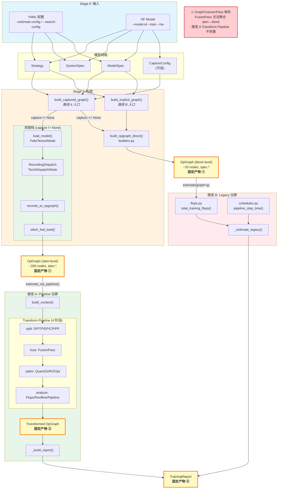
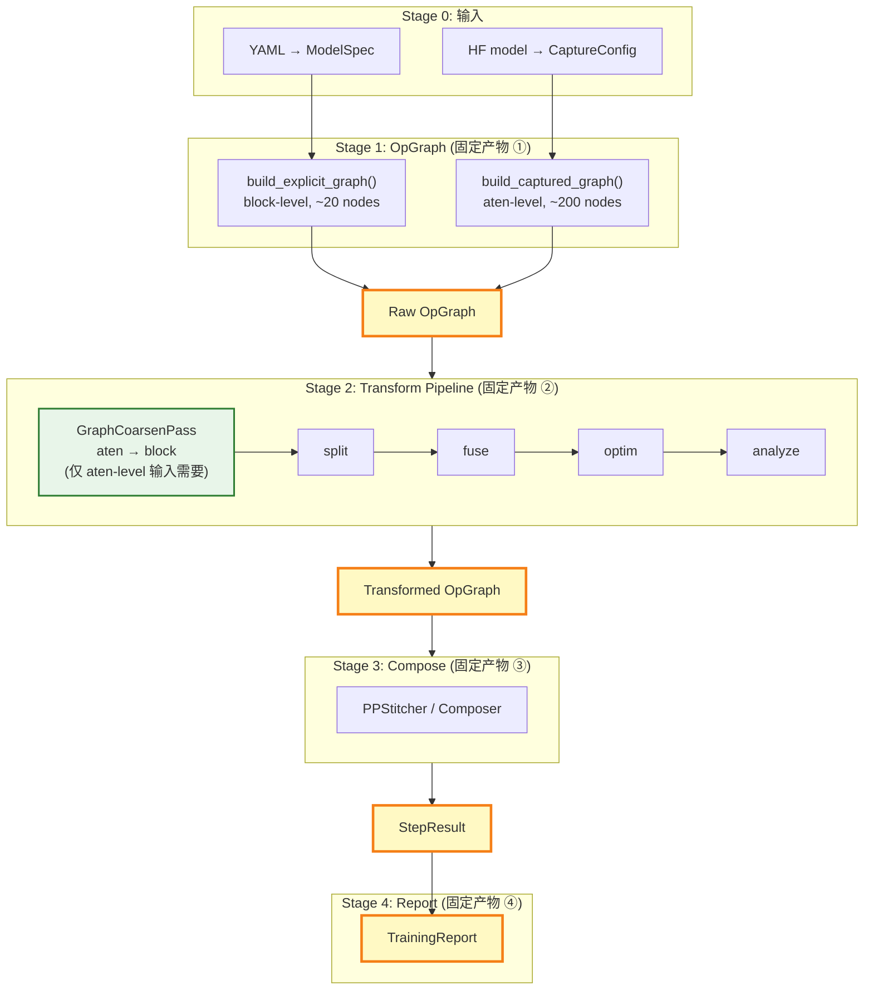
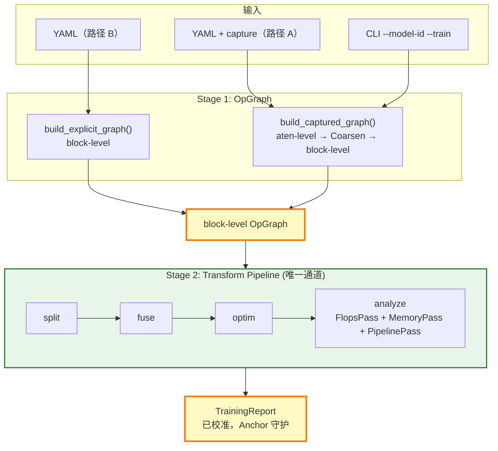

# 架构归一化重构方案

## 1. 现状分析

### 1.1 两套实现路径

| 维度 | 路径 B — 配置建模 (explicit_graph) | 路径 A — 抓图建模 (captured_graph) |
|------|----------------------------------|-----------------------------------|
| **入口** | `--estimate-config <yaml>` / `--search-config <yaml>` | `--model-id <id> --train --hw <hw>` |
| **模型来源** | YAML → `ModelSpec` | HF model → FakeTensorMode 抓图 |
| **构图函数** | `build_explicit_graph()` | `build_captured_graph()` |
| **IR** | `training/ir/training_graph.py` (`Graph`/`Op`/`Tensor`) | `ir/graph.py` (`OpGraph`/`OpNode`/`Edge`) |
| **Op 构建** | `training/ir/builders.py` (手工构造) | `graph/dispatch.py` (运行时抓取) |
| **FLOPs** | `training/models/flops.py` | `transform/analysis/training.py::TrainingFlopsPass` |
| **Memory** | `training/models/memory.py` | `transform/analysis/training.py::TrainingMemoryPass` |
| **Pipeline** | `training/compose/schedules.py::pipeline_step_time()` | `transform/analysis/training.py::TrainingPipelinePass` |
| **导入约定** | `zrt.*` (需 PYTHONPATH=python) | `python.zrt.*` |

### 1.2 重复点清单

| # | 重复模块 | Stack A 位置 | Stack B 位置 | 影响 |
|---|---------|-------------|-------------|------|
| D1 | IR 数据结构 | `training/ir/training_graph.py` (Graph/Op/Tensor/Collective) | `ir/graph.py` (OpGraph/OpNode/Edge/TensorMeta) | 两套 IR 无法互通，下游代码分叉 |
| D2 | Op 构建器 | `training/ir/builders.py` (dense_block/moe_block) | `graph/dispatch.py` + `ir/adapter.py` | 同一模型两种 op 列表，维护成本高 |
| D3 | FLOPs 计算 | `training/models/flops.py::op_cost()` | `transform/analysis/passes.py::FlopsPass` + `TrainingFlopsPass` | 公式重复，容易不一致 |
| D4 | Memory 估算 | `training/models/memory.py::memory_breakdown()` | `transform/analysis/training.py::TrainingMemoryPass` | ZeRO/activation 逻辑重复 |
| D5 | Pipeline 调度 | `training/compose/schedules.py::pipeline_step_time()` | `transform/analysis/training.py::TrainingPipelinePass` | 两套调度逻辑，composer 调用方式不同 |
| D6 | 通信建模 | `training/models/comm.py` | `transform/analysis/comm_latency.py::CommLatencyPass` | 通信延迟公式重复 |

### 1.3 已共享的部分（不动）

- `TrainingReport` (`training/spec/report.py`) — 两条路径已统一输出
- `StepResult` (`training/compose/schedules.py`) — 两条路径已共用
- PP Composers (`OneF1BComposer`, `Interleaved1F1BComposer`, etc.) — 两条路径已共用
- `training/spec/` 下的 `ModelSpec`, `Strategy`, `SystemSpec` — Stack A 专用，保留

---

## 2. 目标架构

### 2.1 核心原则

1. **OpGraph 为唯一 IR** — 废弃 `training/ir/training_graph.py` 的 `Graph`/`Op`/`Tensor`，所有路径统一产出 `OpGraph`
2. **阶段性产物固定** — 每个阶段输出明确的中间产物，两条路径在固定产物点汇合
3. **Transform Pipeline 为唯一分析通道** — Stack A 也走 Transform Pipeline，不再独立计算

### 2.2 当前双路径架构图

当前系统有两条独立的训练估算路径：

- **路径 B（配置建模）**：YAML → ModelSpec → `build_explicit_graph()` → block-level OpGraph → Legacy 手工成本模型
- **路径 A（抓图建模）**：HF Model → `build_captured_graph()` → 抓图栈 → aten-level OpGraph → Transform Pipeline

两条路径在 Stage 1（OpGraph 产物）之后分叉，各自独立计算 FLOPs/Memory/Pipeline，最终在 Stage 4（TrainingReport）汇合。

**关键差异**：路径 B 产出 block-level OpGraph（~20 个高层节点，`spec.*` op_type），路径 A 产出 aten-level OpGraph（~200 个细粒度节点，`aten.*` op_type）。Transform Pipeline 的 Pass 设计假设 block-level 输入，因此路径 A 的 aten-level OpGraph 需要经过 **GraphCoarsenPass**（尚未实现）聚合后才能正确走通 Transform Pipeline。



**已知限制**：
- GraphCoarsenPass 缺失（C6 验证）：FusionPass 无法自动聚合 aten→block，路径 A 的 Transform Pipeline 不完整
- 路径 B 仍走 Legacy 估算（`_estimate_legacy`），未迁移到 Transform Pipeline

### 2.3 目标归一化流程图

归一化后，两条路径在 Stage 1（OpGraph）汇合，统一走 Transform Pipeline：

- **GraphCoarsenPass**（新增）：将 aten-level OpGraph 按 `module_path` 聚合为 block-level OpNode，使路径 A 的抓图输出能正确走通 Transform Pipeline。对 block-level 输入（路径 B）为 no-op。
- **路径 B 迁移**：`_estimate_legacy` 废弃，路径 B 也走 `estimate_via_pipeline()`



### 2.4 固定产物定义

| 阶段 | 产物 | 类型 | 说明 |
|------|------|------|------|
| ① | Raw OpGraph | `ir.graph.OpGraph` | 未变换的原始计算图，包含 fwd/bwd 节点 |
| ② | Transformed OpGraph | `ir.graph.OpGraph` | 经过 split/fuse/optim/analyze 的变换后图 |
| ③ | StepResult | `training.compose.schedules.StepResult` | PP 调度后的步进时间分解 |
| ④ | TrainingReport | `training.spec.report.TrainingReport` | 最终性能报告 |

---

## 3. 分步重构计划

### Phase 1: Stack A 主入口切换到 OpGraph（消除 D1 + D2）

**目标**: Stack A 的 `estimate()` 入口使用 `build_opgraph()` 产出 OpGraph，下游消费者（`flops.py`、`schedules.py`）能直接消费 OpGraph。

**设计原则**: 以抓图路径（Stack B）为主路径，Stack A 作为分支在 Stage 1（OpGraph 产物）汇入主路径。

#### 3.1.1 已完成的基础设施（Phase B2 遗留）

| 组件 | 文件 | 状态 |
|------|------|------|
| `build_opgraph_direct()` | `training/ir/builders.py:1164` | ✅ 直接产出 OpGraph，不经过旧 IR |
| `build_explicit_graph()` | `training/ir/opgraph_builder.py` | ✅ 路径 B 构图入口（配置建模，原 `build_opgraph`） |
| `build_captured_graph()` | `training/ir/opgraph_builder.py` | ✅ 路径 A 构图入口（抓图建模，Pipeline 路径） |
| `insert_collectives_opgraph()` | `training/ir/shard.py` | ✅ OpGraph-native 分片 |
| `insert_cast_pass_opgraph()` | `training/ir/cast_pass.py` | ✅ OpGraph-native cast 插入 |
| `pipeline_step_time()` | `training/compose/schedules.py:744` | ✅ 已接受 OpGraph（鸭子类型） |
| `Op` → `OpNode` 映射 | `builders.py::_op_to_opnode()` | ✅ 含 `_KIND_TO_ATEN_OP` 映射表 |

#### 3.1.2 待完成的切换（Phase 1 核心工作）

**步骤 1**: `estimator.py::estimate()` 切换到 `build_explicit_graph()`

```python
# 修改前
from zrt.training.ir.builders import build_graph
graph = build_graph(model, strategy)  # 返回旧 Graph

# 修改后
from zrt.training.ir.opgraph_builder import build_explicit_graph
graph = build_explicit_graph(model, strategy)  # 返回 OpGraph
```

**步骤 2**: `flops.py` 的 `total_training_flops()` / `forward_backward_flops()` 支持 OpGraph

- 添加 `_iter_ops(graph)` 适配函数：旧 Graph 返回 `graph.ops`，OpGraph 返回非 comm 节点
- 添加 `op_cost_from_node(node, model, system)` 函数：从 OpNode 的 `attrs["spec_kind"]` 分发到对应的 cost 函数
- 保留旧 `op_cost(op: Op, ...)` 不动（20 个测试文件仍在使用）

**步骤 3**: `recompute_overhead_flops()` 同样支持 OpGraph

**步骤 4**: 补充测试验证 `estimate()` 走 OpGraph 路径的结果与旧路径数值一致

#### 3.1.3 Op → OpNode 映射规则（已实现在 `_op_to_opnode()`）

| Op 字段 | OpNode 字段 | 说明 |
|---------|------------|------|
| `Op.name` | `OpNode.id` | 保持 `L0.qkv_proj` 格式 |
| `Op.kind` | `OpNode.op_type` | 通过 `_KIND_TO_ATEN_OP` 映射为 `aten.*` 或 `spec.*` |
| `Op.inputs/outputs` | `OpNode.inputs/outputs` | `Tensor` → `TensorMeta` |
| `Op.meta` | `OpNode.attrs` | 附加 `source=model_spec`、`spec_kind`、`layer_kind` |
| `Op.layer_id` | `OpNode.layer` | 字符串化 |
| `Op.component` | `OpNode.component` | 直接传递 |
| `Collective` | `comm.*` OpNode | `category="communication"` |

#### 3.1.4 关键文件

| 操作 | 文件 | 说明 |
|------|------|------|
| 已建 | `training/ir/opgraph_builder.py` | `build_explicit_graph()` + `build_captured_graph()` 入口 |
| 已建 | `training/ir/builders.py` | `build_opgraph_direct()` + `_op_to_opnode()` |
| 修改 | `training/search/estimator.py` | 切换到 `build_explicit_graph()` / `build_captured_graph()` |
| 修改 | `training/models/flops.py` | 添加 OpGraph 适配（`_iter_ops` + `op_cost_from_node`） |
| 测试 | `tests/training/test_phase1_opgraph_estimate.py` | 验证 OpGraph 路径数值一致性 |

### Phase 2: Stack A 走 Transform Pipeline（消除 D3 + D4 + D5 + D6）

**目标**: Stack A 的 `estimate()` 函数不再独立计算 FLOPs/Memory/Pipeline，而是构建 `TransformContext` 后走 `build_default_pipeline().run()`。

#### 3.2.1 已完成的基础设施

| 组件 | 文件 | 状态 |
|------|------|------|
| `build_context()` | `training/ir/context_builder.py` | ✅ ModelSpec+SystemSpec+Strategy → TransformContext |
| `build_default_pipeline()` | `transform/pipeline.py` | ✅ 4 阶段变换管线 |
| `TrainingFlopsPass` | `transform/analysis/training.py` | ✅ 写入 `metadata["training_flops"]` |
| `TrainingMemoryPass` | `transform/analysis/training.py` | ✅ 写入 `metadata["memory_breakdown"]` |
| `TrainingPipelinePass` | `transform/analysis/training.py` | ✅ 写入 `metadata["step_result"]` |
| `estimate_training_from_graphs()` | `transform/analysis/modeller.py` | ✅ Stack B 参考实现 |

#### 3.2.2 实现方案

**步骤 1**: 新增 `estimate_via_pipeline()` 函数

```python
def estimate_via_pipeline(model, system, strategy) -> TrainingReport:
    opgraph = build_captured_graph(model, strategy)
    _supplement_metadata(opgraph, model, strategy)
    ctx = build_context(model, system, strategy, pp_mode="formula")
    pipe = build_default_pipeline()
    transformed = pipe.run(opgraph, ctx)
    return _build_report_from_transformed(transformed, model, system, strategy)
```

**步骤 2**: `_supplement_metadata()` 补充 `build_opgraph()` 未设置的 metadata

`build_opgraph()` 只设置 8 个基础 key（seq_len, hidden, num_layers, num_layers_traced, batch_size, total_params, param_dtype_bytes, model_name）。Transform Pipeline 还需要：

| Key | 条件 | 来源 |
|-----|------|------|
| `moe_total_experts` | `model.num_experts > 0` | `model.num_experts` |
| `moe_active_experts` | `model.top_k > 1` | `model.top_k` |
| `moe_ffn_hidden` | `model.moe_ffn > 0` | `model.moe_ffn` |
| `vocab_size` | 始终 | `model.vocab` |
| `layer_type_counts` | 始终 | `{kind: count}` from `model.layers` |

**步骤 3**: `_build_report_from_transformed()` 从变换后 OpGraph 提取 TrainingReport

从 `transformed.metadata` 提取：
- `step_result` (dict) → 所有时间字段（ms 单位）
- `training_flops`, `forward_flops`, `backward_flops` → FLOPs 字段
- `memory_breakdown` (TrainingMemoryBreakdown) → memory_breakdown dict
- `total_params` → total_params

**步骤 4**: `estimate()` 委托到 `estimate_via_pipeline()`

```python
def estimate(model, system, strategy, graph=None):
    return estimate_via_pipeline(model, system, strategy)
```

`graph` 参数保留但标记 deprecated（Phase 3 清理）。

#### 3.2.3 关键文件

| 操作 | 文件 | 说明 |
|------|------|------|
| 修改 | `python/zrt/training/search/estimator.py` | 新增 `estimate_via_pipeline()` + `_supplement_metadata()` + `_build_report_from_transformed()`，`estimate()` 委托 |
| 已建 | `python/zrt/training/ir/context_builder.py` | `build_context()` 入口 |
| 测试 | `tests/training/test_phase2_estimate_via_pipeline.py` | Phase 2 测试 |

### Phase 3: 清理旧 IR（消除 D1 残留）✅ 进行中

**目标**: 废弃 `training/ir/training_graph.py` 的 `Graph`/`Op`/`Tensor`/`Collective`，所有下游代码迁移到 `OpGraph`。

#### 3.3.1 现状分析

**旧 IR 引用分布**（36 处 import）：

| 类别 | 文件数 | 引用数 | 说明 |
|------|--------|--------|------|
| 生产代码 | 11 | 11 | builders/shard/cast_pass/opgraph_builder/flops/memory/comm/exporters/graph.py/__init__ |
| 测试代码 | 20 | 25 | 直接构造旧 IR 对象或调用 `build_graph()` |

**旧 IR 函数存活状态**：

| 旧函数 | 文件 | 仍被调用 | OpGraph 替代 |
|--------|------|---------|-------------|
| `build_graph()` | `builders.py` | 是 (search_util ×2, graph.py ×1 死代码) | `build_opgraph_direct()` ✅ |
| `insert_cast_pass()` | `cast_pass.py` | 是 (via `build_graph`) | `insert_cast_pass_opgraph()` ✅ |
| `insert_collectives()` | `shard.py` | 是 (via `build_graph`) | `insert_collectives_opgraph()` ✅ |
| `_convert_to_opgraph()` | `opgraph_builder.py` | **否 — 死代码** | `build_opgraph_direct()` 已取代 |
| `OpGraph.from_model_spec()` | `graph.py` | **否 — 死代码** | `build_opgraph()` 已取代 |
| `graph_adapter.py` | (整个文件) | **否 — 空壳** | 无函数定义，零导入 |

**下游消费者双态兼容状态**（已通过适配器同时支持旧 Graph 和新 OpGraph）：

| 模块 | 适配机制 | graph 参数是否使用 |
|------|---------|-------------------|
| `flops.py` | `_iter_ops()` + `_OpNodeAsOp` | 是 |
| `memory.py` | 签名声明 `Graph` 但函数体不使用 | **否** |
| `comm.py` | `hasattr(graph, "collectives")` 分支 | 是 |
| `schedules.py` | `_ops_for_stage()` + `_collectives_for_stage()` 双态 | 是 |
| `html_exporter.py` | `_iter_ops()` + `_OpNodeAsOp` | 是 |
| `excel_exporter.py` | `_iter_ops()` + `_iter_collectives()` | 是 |

#### 3.3.2 实施步骤

**步骤 0**: 修复 OpNode 兼容性 Bug（2026-06-02）

`stage.py` 中直接使用 `op.kind` 访问属性，但 `OpNode` 对象没有 `kind` 属性（应使用 `_kind(op)` 辅助函数从 `attrs["spec_kind"]` 或 `op_type` 获取）。

受影响位置：
- `stage.py:223` — `if op.kind == "mega_moe":`
- `stage.py:603-604` — `_is_routed_expert_compute()` 函数

修复方案：将所有 `op.kind` 替换为 `_kind(op)`，`op.name` 替换为 `_name(op)`。

**步骤 1**: 删除死代码
- 删除 `graph_adapter.py`（空壳文件）
- 删除 `opgraph_builder.py::_convert_to_opgraph()` 及相关辅助函数
- 删除 `graph.py::OpGraph.from_model_spec()` 类方法

**步骤 2**: 迁移生产代码 `training_search_util.py`
- 第 857 行：`build_graph(model, strategy)` → `build_opgraph(model, strategy)`
- 第 1426 行：`build_graph(model, strategy)` → `build_opgraph(model, strategy)`，`graph.ops` 遍历改为 `opgraph.nodes`
- 下游消费函数（flops/comm/memory/schedules）已有适配层，无需修改

**步骤 3**: 清理生产代码旧 IR 导入
- `flops.py`：移除 `from zrt.training.ir.training_graph import Graph, Op`，类型注解改为 `OpGraph`/`OpNode`
- `memory.py`：移除 `Graph` 导入，`graph` 参数类型改为 `OpGraph | None`
- `comm.py`：移除 `Collective` 导入，移除旧 Graph 分支
- `html_exporter.py` / `excel_exporter.py`：移除旧 IR 类型注解，移除旧 Graph 分支
- `schedules.py` / `stage.py`：移除旧 IR 分支（保留 OpGraph 路径）

**步骤 4**: 删除旧 IR 函数
- `builders.py`：删除 `build_graph()` 函数（保留 `build_opgraph_direct()` + 所有 `*_block()` 辅助函数）
- `cast_pass.py`：删除 `insert_cast_pass()` 函数（保留 `insert_cast_pass_opgraph()`）
- `shard.py`：删除 `insert_collectives()` 函数（保留 `insert_collectives_opgraph()`）
- `opgraph_builder.py`：移除旧 IR 导入

**步骤 5**: 迁移测试代码（按复杂度分批）

| 批次 | 文件 | 复杂度 | 改动内容 |
|------|------|--------|---------|
| 极简 | test_mixed_quant_memory, test_mixed_quant_mfu_native, test_mixed_quant_comm | 极简 | `Graph()` → `OpGraph()` (16 处空占位符) |
| 简单 | test_quant_op_dtypes, test_mixed_quant_op_dispatch, test_ln_softmax_promote, test_excel_exporter, test_excel_exporter_dtype_latency | 简单 | 重写辅助函数 `_op()` / `_ln_op()` 等 |
| 中等 | test_tp_overlap, test_flops, test_attn_cost_dtype, test_html_exporter_formula, test_matmul_cost_byteacc, test_comm_domain | 中等 | 重写 `Op`/`Tensor` fixture + `build_graph` → `build_opgraph` |
| 高 | test_comm, test_cast_pass, test_mhc | 高 | 深度依赖旧 IR 结构，需全面重写 |

**步骤 6**: 删除 `training_graph.py` + 清理 `__init__.py` 旧导出

#### 3.3.3 关键文件

| 操作 | 文件 | 说明 |
|------|------|------|
| 删除 | `python/zrt/training/ir/graph_adapter.py` | 空壳死代码 |
| 删除 | `python/zrt/training/ir/training_graph.py` | 旧 IR 定义（最终） |
| 修改 | `python/zrt/training/ir/builders.py` | 删除 `build_graph()`，保留辅助函数 |
| 修改 | `python/zrt/training/ir/cast_pass.py` | 删除 `insert_cast_pass()` |
| 修改 | `python/zrt/training/ir/shard.py` | 删除 `insert_collectives()` |
| 修改 | `python/zrt/training/ir/opgraph_builder.py` | 删除 `_convert_to_opgraph()` |
| 修改 | `python/zrt/training/ir/__init__.py` | 移除旧 IR 导出 |
| 修改 | `python/zrt/training/models/flops.py` | 移除旧 IR 导入/适配 |
| 修改 | `python/zrt/training/models/memory.py` | 移除旧 IR 导入 |
| 修改 | `python/zrt/training/models/comm.py` | 移除旧 IR 分支 |
| 修改 | `python/zrt/training/search/training_search_util.py` | `build_graph` → `build_opgraph` |
| 修改 | `python/zrt/training/io/html_exporter.py` | 移除旧 IR 分支 |
| 修改 | `python/zrt/training/io/excel_exporter.py` | 移除旧 IR 分支 |
| 修改 | `python/zrt/ir/graph.py` | 删除 `from_model_spec()` |
| 修改 | 20 个测试文件 | 旧 IR → OpGraph 迁移 |

### Phase 4: 统一导入约定

**目标**: 消除 `zrt.*` vs `python.zrt.*` 的混乱。

**方案**: 全部使用 `zrt.*` 导入（`PYTHONPATH=python`）。

**原因**: `python.zrt.*` 和 `zrt.*` 在 Python 模块系统中被视为不同的模块身份，导致 `isinstance()` 检查失败。例如 `python.zrt.ir.graph.OpGraph` 和 `zrt.ir.graph.OpGraph` 是两个不同的类对象。因此所有文件（包括桥接文件）统一使用 `zrt.*` 导入。

**已完成**: Phase 4 验证了 `zrt.*` 作为唯一导入约定的可行性，并记录了 `python.zrt.*` 的陷阱。

---

## 4. 阶段性产物契约

### 4.1 产物 ① — Raw OpGraph

```python
# 无论 Stack A 还是 Stack B，Stage 1 输出的 OpGraph 必须满足：
assert graph.phase in ("prefill", "train_forward", "train_backward", "train")
assert all(n.op_type for n in graph.nodes.values())
assert all(n.annotations.get("phase") in (None, "fwd", "bwd") for n in graph.nodes.values())
# Stack A 特有：op_type 前缀为 "spec."
# Stack B 特有：op_type 前缀为 "aten."
```

### 4.2 产物 ② — Transformed OpGraph

```python
# Stage 2 输出必须满足：
assert "training_flops" in graph.metadata
assert "memory_breakdown" in graph.metadata
assert "pipeline_metrics" in graph.metadata
assert isinstance(graph.metadata["pipeline_metrics"], PipelineStepMetrics)
```

### 4.3 产物 ③ — StepResult

```python
# Stage 3 输出（已在两条路径共享）：
assert result.step_time > 0
assert result.pipeline_time > 0
assert 0 <= result.bubble_fraction <= 1
```

### 4.4 产物 ④ — TrainingReport

```python
# Stage 4 输出（已统一）：
assert report.step_time_ms > 0
assert 0 <= report.mfu <= 1
```


## 6. 执行顺序与依赖

```
Phase B2 (builders 直接产出 OpGraph)             ✅ 已完成
    │
    ├── build_opgraph_direct() + insert_collectives_opgraph()
    │
    ▼
Phase 1 (Stack A 入口切换到 OpGraph)             ✅ 已完成
    │
    ├── estimator.py 改用 build_opgraph()
    ├── flops.py 添加 OpGraph 适配
    ├── UT: estimate() OpGraph 路径数值一致性
    │
    ▼
Phase 2 (Stack A 走 Transform Pipeline)          ✅ 已完成
    │
    ├── context_builder.py 已建 ✅
    ├── estimate_via_pipeline() 新增 ✅
    ├── estimate() 委托 estimate_via_pipeline() ✅
    │
    ▼
Phase 3 (清理旧 IR)                              ⏳ 进行中
    │
    ├── 36 处旧 IR import 待迁移
    ├── 删除 training_graph.py
    │
    ▼
Phase 4 (统一导入约定)                           ✅ 已完成
    │
    ├── zrt.* 为唯一导入约定
    │
    ▼
Phase C (抓图路径接入)                           ✅ C1-C8 已完成
    │
    ├── C1: CaptureConfig dataclass ✅
    ├── C2: build_captured_graph 真实实现 ✅
    ├── C3: estimate_via_pipeline 加 capture 参数 ✅
    ├── C4: config_loader 解析 capture: 段 ✅
    ├── C5: CLI _run_capture_estimate ✅
    ├── C6: FusionPass 聚合验证 → 发现需要 GraphCoarsenPass ⚠
    ├── C7: _run_training_modelling 废弃标记 ✅
    ├── C8: compare_paths.py 支持 capture ✅
    │
    ▼
Phase D (GraphCoarsenPass)                       ⏳ 待实现 → 与 E2 合并
    │
    ├── 按 module_path 聚合 aten→block
    ├── 路径 A 完整走通 Transform Pipeline
    ├── 废弃 _run_training_modelling
    │
    ▼
Phase E (统一性能评估路径)                        ⏳ 待开始  ← 详见 §12
    │
    ├── E1: Pipeline 校准 (4 基线模型 × 多硬件, 以 Legacy 为锚)
    │     ├── E1.1: 校准基础设施 (calibration_utils + 逐 Pass 测试)
    │     ├── E1.2: TrainingFlopsPass 校准 (FP4/HC/CSA/SWA 感知)
    │     ├── E1.3: TrainingMemoryPass 校准 (FP4 权重/Muon/HC 激活)
    │     ├── E1.4: TrainingPipelinePass 校准 (DualPipeV/Muon/层间不均)
    │     └── E1.5: 全基线回归验证 (15 Anchor × 86 字段)
    │
    ├── E2: GraphCoarsenPass (= Phase D 合并实施)
    │     ├── E2.1: 聚合规则 (V4 特有: HC/Indexer/Compressor)
    │     ├── E2.2: 路径 A 端到端验证
    │     └── E2.3: Coarsen 输出 vs explicit graph 结构对比
    │
    ├── E3: 路径 B 迁移到 Transform Pipeline
    │     ├── E3.1: estimate() 统一入口 (_estimate_legacy 废弃)
    │     ├── E3.2: Anchor 测试迁移
    │     └── E3.3: compare_paths.py 全基线验证
    │
    └── E4: Legacy 清理 + 回归守护
          ├── E4.1: Legacy 代码废弃与删除
          ├── E4.2: Golden value 回归守护 (V4 Pro/Flash 为锚点)
          └── E4.3: 文档更新
    │
    ▼
完成 — 单一评估路径 (estimate_via_pipeline)
```

## 12. Phase E：统一性能评估路径

### 12.1 背景与动机

Phase 1-2 已统一 OpGraph IR，但性能评估仍分两条独立分支：

| 维度 | 路径 B — Legacy 手工成本模型 | 路径 A — Transform Pipeline |
|------|---------------------------|---------------------------|
| **入口** | `estimate(graph=graph)` → `_estimate_legacy()` | `estimate_via_pipeline()` |
| **FLOPs** | `flops.py::total_training_flops()` | `TrainingFlopsPass` |
| **Memory** | `memory.py::memory_breakdown()` | `TrainingMemoryPass` |
| **Pipeline** | `schedules.py::pipeline_step_time()` | `TrainingPipelinePass` |
| **校准状态** | **已校准**（Anchor 锚点守护） | **未校准** |

**核心矛盾**：Transform Pipeline 要成为唯一评估通道，但其分析 Pass 是独立实现，与 Legacy 公式存在差异。路径 B 的 Legacy 结果经过校准（Anchor MFU/step_time 与真实值对齐），是可信基线。

**目标**：以路径 B 已校准结果为基线，校准 Transform Pipeline，最终统一为单一评估路径。

### 12.2 基线模型矩阵

选择 4 个代表性模型覆盖所有架构维度，确保校准的全面性：

| 模型 | 参数量 | 架构类型 | 注意力 | MoE | 特殊特性 | 校准价值 |
|------|--------|---------|--------|-----|---------|---------|
| **Llama-3 70B** | 70B | Dense | GQA | 无 | 标准 Transformer | Dense 基线，验证基础 FLOPs/Memory 公式 |
| **DeepSeek-V3** | 671B | MoE | MLA | 256 experts, top_k=8 | sigmoid routing, Adam | MoE + MLA 基线，验证 MoE FLOPs 和 EP 通信 |
| **DeepSeek-V4 Pro** | 1.6T | MoE | V4-style (CSA/HCA) | 384 experts, top_k=6 | FP4 experts, HC, hash routing, Muon | 全特性大模型，验证 V4 全栈成本模型 |
| **DeepSeek-V4 Flash** | 291B | MoE | V4-style (CSA/HCA/SWA) | 256 experts, top_k=6 | FP4 experts, HC, SWA-only layers, Muon | 全特性小模型，验证层类型混合和缩放正确性 |

#### 12.2.1 V4 架构特有的校准维度

V4 Pro 和 V4 Flash 引入了多项 Legacy 成本模型中已建模但 Pipeline Pass 中可能缺失或公式不一致的特性：

| 校准维度 | Legacy 实现位置 | Pipeline Pass | 风险等级 |
|---------|----------------|---------------|---------|
| **FP4 专家计算成本** | `flops.py::op_cost()` 按 `routed_expert_compute_dtype` 分发 | `TrainingFlopsPass` 是否感知 dtype？ | 🔴 高 |
| **FP4 权重存储** | `memory.py` 按 `routed_expert_weight_dtype` 计算 `stored_bytes` | `TrainingMemoryPass` 量化感知路径 | 🟡 中 |
| **Hyper-Connections** | `flops.py` 中 `hc_pre`/`hc_post` op_cost | `TrainingFlopsPass` 是否识别 HC 节点？ | 🔴 高 |
| **CSA/HCA 注意力** | `flops.py` 按 `compress_ratios` 计算 KV 压缩成本 | `TrainingFlopsPass` 是否区分 CSA/HCA？ | 🔴 高 |
| **SWA-only 层** | `flops.py` 按 `swa_window` 计算稀疏注意力 FLOPs | `TrainingFlopsPass` 是否处理 SWA？ | 🟡 中 |
| **Hash routing** | `flops.py` 中 hash 路由 vs softmax 路由的 FLOPs 差异 | `TrainingFlopsPass` 路由成本 | 🟢 低 |
| **Muon 优化器** | `schedules.py` + `memory.py` 中 Muon NS 步骤 + AllGather | `TrainingPipelinePass` 优化器步时间 | 🟡 中 |
| **混合精度梯度** | `memory.py` 按组件 dtype 分别计算 grad 存储 | `TrainingMemoryPass` 梯度分片 | 🟡 中 |
| **Indexer 内存** | `memory.py` 中 Lightning Indexer 缓冲 | `TrainingMemoryPass` 通信缓冲 | 🟢 低 |

#### 12.2.2 基线硬件矩阵

每个基线模型在多种硬件上校准，覆盖不同计算/通信特征：

| 模型 | H100 SXM | H800 | Ascend 910C | B300 |
|------|----------|------|-------------|------|
| Llama-3 70B | ✅ `llama3_70b_meta` | — | — | — |
| DeepSeek-V3 | ✅ `deepseek_v3` | — | — | — |
| DeepSeek-V3.2 | ✅ `deepseek_v3_2` | ✅ `deepseek_v3_2_h800` | ✅ `deepseek_v3_2_ascend_910c` | — |
| DeepSeek-V4 Pro | ✅ `deepseek_v4_pro` | ✅ `deepseek_v4_pro_h800` | ✅ `deepseek_v4_pro_ascend_910c` | ✅ `deepseek_v4_pro_fp8_fp4_b300` |
| DeepSeek-V4 Flash | ✅ `deepseek_v4_flash` | ✅ `deepseek_v4_flash_h800` | ✅ `deepseek_v4_flash_ascend_910c` | — |

**已有 Anchor 数量**：15 个（覆盖 5 模型 × 多硬件），其中 V4 系列占 9 个。

### 12.3 校准方法论

#### 12.3.1 校准原理

```
路径 B (已校准基线):
  YAML → ModelSpec → build_explicit_graph() → block-level OpGraph
       → _estimate_legacy() → TrainingReport_B (与 Anchor targets 对齐)

路径 A (待校准):
  YAML → ModelSpec → build_captured_graph(capture=None) → block-level OpGraph (同一个图!)
       → estimate_via_pipeline() → TrainingReport_A

对比: TrainingReport_A vs TrainingReport_B
  → 差异来源 = Pipeline Pass 公式 vs Legacy 公式
  → 以 Legacy 为准修正 Pipeline Pass
```

**关键洞察**：当 `capture=None` 时，`build_captured_graph()` 回退到 `build_opgraph_direct()`，与 `build_explicit_graph()` 产出**完全相同的** block-level OpGraph。因此两条路径的输入完全一致，输出差异只能来自分析逻辑。

#### 12.3.2 校准指标（按优先级排序）

| 优先级 | 指标 | 容差 | 说明 |
|--------|------|------|------|
| P0 | `total_flops` | < 0.1% | FLOPs 是确定性公式，必须完全一致 |
| P0 | `forward_flops` / `backward_flops` | < 0.1% | 同上 |
| P0 | `total_params` | < 0.1% | 参数量是确定性计算 |
| P1 | `step_time_ms` | < 1% | 核心性能指标，依赖 roofline 模型 |
| P1 | `mfu` | < 1% | 由 FLOPs 和 step_time 推导 |
| P1 | `compute_time_ms` | < 1% | 计算时间分解 |
| P2 | `memory` 各项 | < 2% | 内存分解（weights/grads/opt/act） |
| P2 | `bubble_fraction` | < 2% | PP 调度效率 |
| P3 | 通信分解各项 | < 5% | TP/CP/EP/PP/DP exposed/hidden |
| P3 | `optimizer_time_ms` | < 5% | Adam/Muon 步时间 |

#### 12.3.3 校准流程（逐 Pass）

```
Step 1: TrainingFlopsPass 校准
  ├── 输入: 4 个基线模型的 block-level OpGraph
  ├── 对比: TrainingFlopsPass 输出 vs flops.py::total_training_flops()
  ├── 逐 op 对比: 每个 OpNode 的 FLOPs 贡献
  └── 修复: 公式差异（预期: V4 特有 op 的 FLOPs 计算）

Step 2: TrainingMemoryPass 校准
  ├── 输入: 同上
  ├── 对比: TrainingMemoryPass 输出 vs memory.py::memory_breakdown()
  ├── 逐项对比: weights / grads / opt_state / activations / comm_buffers
  └── 修复: ZeRO 分片、量化感知、激活内存公式

Step 3: TrainingPipelinePass 校准
  ├── 输入: 同上
  ├── 对比: TrainingPipelinePass 输出 vs schedules.py::pipeline_step_time()
  ├── 逐阶段对比: warmup / steady / cooldown 时间分解
  └── 修复: 通信重叠、PP 调度、优化器步时间
```

### 12.4 分阶段实施计划

```
Phase E1: Pipeline 校准（block-level 基线对齐）     ⏳ 待开始
    │
    ├── E1.1: 校准基础设施搭建
    ├── E1.2: TrainingFlopsPass 校准
    ├── E1.3: TrainingMemoryPass 校准
    ├── E1.4: TrainingPipelinePass 校准
    ├── E1.5: 全基线回归验证
    ├── E1.6: 趋势校准 (monotonicity / direction checks)
    │
    ▼
Phase E2: GraphCoarsenPass 实现                     ⏳ 待实现 (即 Phase D)
    │
    ├── E2.1: 聚合规则设计与实现
    ├── E2.2: 路径 A 端到端验证
    ├── E2.3: Coarsen 后 OpGraph 与 block-level 对比
    │
    ▼
Phase E3: 路径 B 迁移到 Transform Pipeline          ⏳ 待开始
    │
    ├── E3.1: estimate() 统一入口
    ├── E3.2: Anchor 测试迁移
    ├── E3.3: compare_paths.py 验证
    │
    ▼
Phase E4: Legacy 清理 + 回归守护                    ⏳ 待开始
    │
    ├── E4.1: Legacy 代码废弃与删除
    ├── E4.2: Golden value 回归守护
    ├── E4.3: 文档更新
    │
    ▼
完成 — 单一评估路径
```

### 12.5 Phase E1: Pipeline 校准（block-level 基线对齐）

**目标**：让 Transform Pipeline 在 block-level OpGraph 上的输出与 Legacy 已校准结果数值对齐。

#### 12.5.1 E1.1 校准基础设施搭建

**新增文件**：`tests/training/calibration/test_pipeline_calibration.py`

```python
"""Pipeline 校准测试 — 以 Legacy 路径为基线，逐 Pass 对比 Transform Pipeline 输出。

原理: 两条路径在 capture=None 时消费完全相同的 block-level OpGraph，
      输出差异只能来自分析逻辑（Pipeline Pass vs Legacy 函数）。
观测点: 每个基线模型 × 每个硬件配置 × 每个数值指标的差异百分比。
"""

BASELINES = [
    # (model_yaml, system_yaml, strategy_overrides, anchor_yaml)
    ("llama3_70b",       "nvidia_h100_sxm", {"tp": 8, "pp": 1, "dp": 8},  "llama3_70b_meta"),
    ("deepseek_v3",      "nvidia_h100_sxm", {"tp": 8, "pp": 1, "dp": 8},  "deepseek_v3"),
    ("deepseek_v4_pro",  "nvidia_h100_sxm", {"tp": 8, "pp": 4, "ep": 64, "dp": 2}, "deepseek_v4_pro"),
    ("deepseek_v4_pro",  "nvidia_h800",     {"tp": 8, "pp": 4, "ep": 64, "dp": 2}, "deepseek_v4_pro_h800"),
    ("deepseek_v4_flash","nvidia_h100_sxm", {"tp": 8, "pp": 1, "ep": 64, "dp": 8}, "deepseek_v4_flash"),
    ("deepseek_v4_flash","nvidia_h800",     {"tp": 8, "pp": 2, "ep": 32, "dp": 2}, "deepseek_v4_flash_h800"),
]

@pytest.mark.parametrize("model_id,system_id,strategy_overrides,anchor_id", BASELINES)
def test_flops_pass_calibration(model_id, system_id, strategy_overrides, anchor_id):
    """TrainingFlopsPass 的 FLOPs 输出必须与 flops.py::total_training_flops() 一致。
    
    原理: FLOPs 是确定性公式（2 * params * tokens 的变体），两条路径必须产出相同值。
    观测点: total_flops, forward_flops, backward_flops 差异 < 0.1%。
    """
    ...

@pytest.mark.parametrize("model_id,system_id,strategy_overrides,anchor_id", BASELINES)
def test_memory_pass_calibration(model_id, system_id, strategy_overrides, anchor_id):
    """TrainingMemoryPass 的内存分解必须与 memory.py::memory_breakdown() 一致。
    
    原理: 内存按 ZeRO 阶段分片，各组件（weights/grads/opt/act）的公式需逐一对齐。
    观测点: 各分项差异 < 2%，V4 FP4 权重存储需特别关注。
    """
    ...

@pytest.mark.parametrize("model_id,system_id,strategy_overrides,anchor_id", BASELINES)
def test_pipeline_pass_calibration(model_id, system_id, strategy_overrides, anchor_id):
    """TrainingPipelinePass 的调度结果必须与 schedules.py::pipeline_step_time() 一致。
    
    原理: PP 调度（1F1B/DualPipeV）的时间分解需逐阶段对齐。
    观测点: step_time_ms 差异 < 1%，warmup/steady/cooldown 分解差异 < 2%。
    """
    ...
```

**新增文件**：`tests/training/calibration/calibration_utils.py`

```python
"""校准工具函数 — 运行两条路径并返回结构化对比结果。"""

def run_both_paths(model, system, strategy) -> dict:
    """运行 Legacy 和 Pipeline 两条路径，返回逐字段对比结果。
    
    返回:
        {field_name: {"legacy": float, "pipeline": float, "diff_pct": float}}
    """
    from zrt.training.ir.opgraph_builder import build_explicit_graph
    from zrt.training.search.estimator import estimate, estimate_via_pipeline

    graph = build_explicit_graph(model, strategy)
    report_legacy = estimate(model, system, strategy, graph=graph)
    report_pipeline = estimate_via_pipeline(model, system, strategy)

    comparison = {}
    for field in NUMERIC_FIELDS:
        v_leg = getattr(report_legacy, field, 0.0) or 0.0
        v_pipe = getattr(report_pipeline, field, 0.0) or 0.0
        denom = max(abs(v_leg), abs(v_pipe), 1e-12)
        comparison[field] = {
            "legacy": v_leg,
            "pipeline": v_pipe,
            "diff_pct": abs(v_leg - v_pipe) / denom,
        }
    return comparison
```

#### 12.5.2 E1.2 TrainingFlopsPass 校准

**修改文件**：`python/zrt/transform/analysis/training.py::TrainingFlopsPass`

**预期差异点与修复方案**：

| 差异来源 | Legacy 公式 | Pipeline 公式 | 修复方向 |
|---------|------------|--------------|---------|
| V4 FP4 专家 FLOPs | `op_cost()` 按 `routed_expert_compute_dtype` 选择 roofline 分支 | `FlopsPass` 可能不感知 dtype | 添加 dtype-aware roofline 分发 |
| HC 节点 FLOPs | `hc_pre`/`hc_post` 有独立 `op_cost()` | 可能未被识别为计算节点 | 确保 HC op_type 被 FlopsPass 处理 |
| CSA 压缩 FLOPs | 按 `compress_ratio` 缩放 KV 投影成本 | 可能统一按全注意力计算 | 添加 compress_ratio 感知 |
| SWA FLOPs | 按 `swa_window` 限制注意力复杂度 | 可能按全 seq_len 计算 | 添加 SWA 窗口感知 |
| compute-bound 过滤 | `total_training_flops()` 只计 matmul/attention | Pipeline 可能计入所有 op | 对齐 compute-bound 判定逻辑 |

**校准验证**：

```python
def test_flops_pass_v4_pro_calibration():
    """V4 Pro 的 TrainingFlopsPass 必须正确处理 FP4 专家和 HC 节点。
    
    原理: V4 Pro 有 384 个 FP4 专家和 4x HC 乘法器，FLOPs 贡献占比显著。
    观测点:
      - total_flops 与 Legacy 差异 < 0.1%
      - 逐层 FLOPs: MoE 层 (384 experts × 3072 ffn × FP4) 需精确匹配
      - HC 开销: hc_pre + hc_post 的 FLOPs 需被正确计入
    """
    model = load_model("deepseek_v4_pro")
    system = load_system("nvidia_h100_sxm")
    strategy = make_strategy(tp=8, pp=4, ep=64, dp=2)
    
    comparison = run_both_paths(model, system, strategy)
    assert comparison["total_flops"]["diff_pct"] < 0.001  # < 0.1%
    assert comparison["forward_flops"]["diff_pct"] < 0.001
    assert comparison["backward_flops"]["diff_pct"] < 0.001
```

#### 12.5.3 E1.3 TrainingMemoryPass 校准

**修改文件**：`python/zrt/transform/analysis/training.py::TrainingMemoryPass`

**预期差异点与修复方案**：

| 差异来源 | Legacy 公式 | Pipeline 公式 | 修复方向 |
|---------|------------|--------------|---------|
| FP4 权重存储 | `memory.py` 按 `routed_expert_weight_dtype=FP4` 计算 0.5B/param | `TrainingMemoryPass` 量化感知路径是否覆盖 routed_expert？ | 确保 quant_profile 覆盖 V4 FP4 |
| Muon 优化器状态 | `memory.py` 用 8.4B/P (Muon) vs 12B/P (Adam) | `OptimizerPass` 注解 `state_bytes` | 验证 Muon state_bytes 注解 |
| HC 激活内存 | `memory.py` 中 HC 层激活系数不同 | 可能按标准层系数计算 | 添加 HC 层激活系数 |
| 激活内存系数 | `memory.py` 按层类型（dense=10, MoE=14, MTP=12） | `_graph_native_activations()` 从边存活期计算 | 验证图原生路径是否覆盖 V4 拓扑 |
| Muon NS 瞬态缓冲 | `memory.py::_muon_ns_peak_buffer()` | 可能未建模 | 添加 Muon AllGather + X^TX 缓冲 |
| PP in-flight | `memory.py::_pp_in_flight()` 按调度类型 | 可能简化处理 | 对齐 DualPipeV 的并发 microbatch 数 |

**校准验证**：

```python
def test_memory_pass_v4_pro_calibration():
    """V4 Pro 的 TrainingMemoryPass 必须正确处理 FP4 权重和 Muon 状态。
    
    原理: V4 Pro 1.6T 参数中 ~85% 是 routed experts (FP4 存储)，
          Muon 优化器状态 8.4B/P 而非 Adam 12B/P。
    观测点:
      - weights: FP4 routed experts = 0.5 B/param × ~1.36T params ≈ 680 GB
      - opt_state: Muon 8.4 B/P × 有效参数量
      - activations: HC 层 (hc_mult=4) 的额外激活存储
    """
    model = load_model("deepseek_v4_pro")
    system = load_system("nvidia_h100_sxm")
    strategy = make_strategy(tp=8, pp=4, ep=64, dp=2, zero_stage=1, optimizer="muon")
    
    comparison = run_both_paths(model, system, strategy)
    assert comparison["weight_hbm_gb"]["diff_pct"] < 0.02   # < 2%
    assert comparison["act_hbm_gb"]["diff_pct"] < 0.02
    assert comparison["grad_hbm_gb"]["diff_pct"] < 0.02
```

#### 12.5.4 E1.4 TrainingPipelinePass 校准

**修改文件**：`python/zrt/transform/analysis/training.py::TrainingPipelinePass`

**预期差异点与修复方案**：

| 差异来源 | Legacy 公式 | Pipeline 公式 | 修复方向 |
|---------|------------|--------------|---------|
| DualPipeV 调度 | `schedules.py` 有 DualPipeV 专用 Composer | `PPStitcher` 是否支持 DualPipeV？ | 验证/扩展 PPStitcher |
| Muon 优化器步 | `schedules.py` 中 Muon NS + AllGather/ReduceScatter | `TrainingPipelinePass` 优化器步时间模型 | 对齐 Muon 时间模型 |
| V4 通信模式 | EP A2A + TP AG/RS + HC AllGather | 通信分解是否覆盖 HC 通信？ | 添加 HC 通信建模 |
| 层间负载不均 | CSA 层 vs HCA 层计算量不同 | 可能假设同质层 | 添加层类型负载权重 |
| VPP 调度 | `vpp_chunks=2` 的 virtual pipeline | `PPStitcher` VPP 支持 | 验证 VPP 调度正确性 |

**校准验证**：

```python
def test_pipeline_pass_v4_pro_dualpipev_calibration():
    """V4 Pro + DualPipeV 的 TrainingPipelinePass 必须正确处理 VPP 和 Muon。
    
    原理: V4 Pro 使用 DualPipeV (vpp_chunks=2) + Muon 优化器，
          调度分解为 warmup/steady/cooldown，通信重叠模式与 1F1B 不同。
    观测点:
      - step_time_ms: 与 Legacy 差异 < 1%
      - bubble_fraction: DualPipeV 的 bubble 应接近 0 (pipeline 几乎满载)
      - optimizer_time_ms: Muon NS 步骤时间 + AllGather 通信
      - ep_exposed_ms: 384 experts 的 A2A 通信暴露时间
    """
    model = load_model("deepseek_v4_pro")
    system = load_system("nvidia_h100_sxm")
    strategy = make_strategy(
        tp=8, pp=4, ep=64, dp=2,
        pp_schedule="dualpipev", vpp_chunks=2,
        optimizer="muon",
    )
    
    comparison = run_both_paths(model, system, strategy)
    assert comparison["step_time_ms"]["diff_pct"] < 0.01    # < 1%
    assert comparison["mfu"]["diff_pct"] < 0.01
    assert comparison["bubble_fraction"]["diff_pct"] < 0.02
    assert comparison["optimizer_time_ms"]["diff_pct"] < 0.05
```

#### 12.5.5 E1.5 全基线回归验证

**新增文件**：`tests/training/calibration/test_full_baseline_regression.py`

```python
"""全基线端到端回归测试 — 确保 Pipeline 在所有基线模型上与 Legacy 对齐。

原理: 在 E1.2-E1.4 逐 Pass 修复后，端到端验证所有基线模型 × 硬件组合。
观测点: 每个 Anchor 的 86 个数值字段均在容差内。
"""

FULL_MATRIX = [
    # Llama-3 70B (Dense 基线)
    ("llama3_70b", "llama3_70b_meta"),
    # DeepSeek-V3 (MoE + MLA 基线)
    ("deepseek_v3", "deepseek_v3"),
    # DeepSeek-V3.2 (MoE + MLA + Indexer)
    ("deepseek_v3_2", "deepseek_v3_2"),
    ("deepseek_v3_2", "deepseek_v3_2_h800"),
    ("deepseek_v3_2", "deepseek_v3_2_ascend_910c"),
    # DeepSeek-V4 Pro (全特性大模型)
    ("deepseek_v4_pro", "deepseek_v4_pro"),
    ("deepseek_v4_pro", "deepseek_v4_pro_h800"),
    ("deepseek_v4_pro", "deepseek_v4_pro_ascend_910c"),
    ("deepseek_v4_pro", "deepseek_v4_pro_fp8_fp4_h100"),
    ("deepseek_v4_pro", "deepseek_v4_pro_fp8_fp4_b300"),
    # DeepSeek-V4 Flash (全特性小模型)
    ("deepseek_v4_flash", "deepseek_v4_flash"),
    ("deepseek_v4_flash", "deepseek_v4_flash_h800"),
    ("deepseek_v4_flash", "deepseek_v4_flash_ascend_910c"),
]

@pytest.mark.parametrize("model_id,anchor_id", FULL_MATRIX)
def test_pipeline_matches_legacy(model_id, anchor_id):
    """Pipeline 输出必须与 Legacy 在容差内一致。
    
    原理: 两条路径消费相同的 block-level OpGraph，差异只能来自分析逻辑。
    观测点: P0 指标 < 0.1%, P1 指标 < 1%, P2 指标 < 2%, P3 指标 < 5%。
    """
    ...
```

#### 12.5.6 E1.6 趋势校准（Monotonicity / Direction Checks）

**目标**：验证估算器在配置参数单调变化时，输出指标的变化方向符合物理直觉。

**原理**：数值校准（E1.2-E1.5）确保单点精度，但无法捕获公式的系统性错误。例如，一个 FLOPs 公式可能在某个点上恰好与 Legacy 一致，但在参数变化时趋势错误（如 TP 增大但显存反而上升）。趋势校准通过扫描参数空间、验证输出方向，捕获这类系统性缺陷。

**方法论**：固定基线配置，逐一扫描某个参数的变化序列，断言指定指标的变化方向（单调递增/递减/先降后升等）。

**新增文件**：`tests/training/calibration/test_trend_calibration.py`

```python
"""趋势校准测试 — 验证配置参数变化时输出指标的方向正确性。

原理: 数值校准保证单点精度，趋势校准保证公式的系统性正确性。
      如果 TP 增大但显存反而上升，说明分片公式有 bug，即使某个 TP 值恰好正确。
观测点: 每个扫描方向上，相邻两点之间的指标变化方向是否符合预期。
"""
```

##### T1: 并行度趋势

**T1.1 TP 增大扫描**

```python
@pytest.mark.parametrize("model_id", ["llama3_70b", "deepseek_v4_pro", "deepseek_v4_flash"])
def test_trend_tp_increase(model_id):
    """TP 增大时：显存分片更多→下降，TP 通信更多→上升。

    原理: TP 将权重/激活按 head 维度切分到更多 GPU，每 GPU 持有量下降；
          但每层需要 AllGather(forward) + ReduceScatter(backward)，通信量 = 2 × (TP-1)/TP × volume。
    观测点:
      - weight_hbm_gb: 严格递减 (每 GPU 持有的权重 = total / TP)
      - act_hbm_gb: 严格递减 (激活按 TP 分片)
      - tp_total_ms: 严格递增 (通信次数 = 2 × num_layers, 消息量 ∝ (TP-1)/TP)
      - total_flops: 不变 (总计算量与 TP 无关)
      - grad_hbm_gb: 严格递减 (梯度按 TP 分片)
    """
    model = load_model(model_id)
    system = load_system("nvidia_h100_sxm")
    tp_values = [1, 2, 4, 8]  # 需要 world_size 足够

    reports = []
    for tp in tp_values:
        strategy = make_strategy(model, tp=tp, dp=max(1, system.world_size // tp))
        reports.append(estimate_via_pipeline(model, system, strategy))

    for i in range(len(reports) - 1):
        assert reports[i+1].weight_hbm_gb < reports[i].weight_hbm_gb, \
            f"TP {tp_values[i]}→{tp_values[i+1]}: weight_hbm_gb 应递减"
        assert reports[i+1].act_hbm_gb < reports[i].act_hbm_gb, \
            f"TP {tp_values[i]}→{tp_values[i+1]}: act_hbm_gb 应递减"
        assert reports[i+1].tp_total_ms > reports[i].tp_total_ms, \
            f"TP {tp_values[i]}→{tp_values[i+1]}: tp_total_ms 应递增"
        assert abs(reports[i+1].total_flops - reports[i].total_flops) / reports[i].total_flops < 0.001, \
            f"TP {tp_values[i]}→{tp_values[i+1]}: total_flops 应不变"
```

**T1.2 PP 增大扫描**

```python
@pytest.mark.parametrize("model_id", ["llama3_70b", "deepseek_v4_pro"])
def test_trend_pp_increase(model_id):
    """PP 增大时：bubble 比例上升，单 stage 显存下降。

    原理: PP 将层切分到更多 stage，每个 stage 持有的层数 = num_layers / PP；
          bubble = (PP-1) / num_microbatches，PP 越大 bubble 越显著。
    观测点:
      - bubble_fraction: 严格递增 (bubble ∝ (PP-1) / M)
      - weight_hbm_gb: 严格递减 (每 stage 持有层数减少)
      - act_hbm_gb: 严格递减 (每 stage 激活减少)
      - step_time_ms: 非严格，但 bubble_time_ms 严格递增
      - total_flops: 不变 (总计算量与 PP 无关，仅分片方式变化)
    """
    model = load_model(model_id)
    system = load_system("nvidia_h100_sxm")
    pp_values = [1, 2, 4]

    reports = []
    for pp in pp_values:
        strategy = make_strategy(model, pp=pp, tp=8, dp=max(1, system.world_size // (8 * pp)))
        reports.append(estimate_via_pipeline(model, system, strategy))

    for i in range(len(reports) - 1):
        assert reports[i+1].bubble_fraction > reports[i].bubble_fraction, \
            f"PP {pp_values[i]}→{pp_values[i+1]}: bubble_fraction 应递增"
        assert reports[i+1].weight_hbm_gb < reports[i].weight_hbm_gb, \
            f"PP {pp_values[i]}→{pp_values[i+1]}: weight_hbm_gb 应递减"
        assert reports[i+1].bubble_time_ms > reports[i].bubble_time_ms, \
            f"PP {pp_values[i]}→{pp_values[i+1]}: bubble_time_ms 应递增"
```

**T1.3 EP 增大扫描**

```python
@pytest.mark.parametrize("model_id", ["deepseek_v4_pro", "deepseek_v4_flash"])
def test_trend_ep_increase(model_id):
    """EP 增大时：每 rank 持有的专家数减少→专家显存下降，EP A2A 通信上升。

    原理: EP 将 num_experts 个专家按 EP 分片，每 rank 持有 num_experts/EP 个专家；
          All-to-All 通信量 = 2 × top_k × hidden × seq_len × (EP-1)/EP。
    观测点:
      - weight_hbm_gb: 严格递减 (专家权重按 EP 分片)
      - ep_total_ms: 严格递增 (A2A 通信量 ∝ (EP-1)/EP)
      - total_flops: 不变 (每 token 仍激活 top_k 个专家)
      - grad_hbm_gb: 严格递减 (专家梯度按 EP 分片)
    """
    model = load_model(model_id)
    system = load_system("nvidia_h100_sxm")
    ep_values = [1, 8, 32, 64]

    reports = []
    for ep in ep_values:
        strategy = make_strategy(model, tp=8, ep=ep, dp=max(1, system.world_size // (8 * ep)))
        reports.append(estimate_via_pipeline(model, system, strategy))

    for i in range(len(reports) - 1):
        assert reports[i+1].weight_hbm_gb < reports[i].weight_hbm_gb, \
            f"EP {ep_values[i]}→{ep_values[i+1]}: weight_hbm_gb 应递减"
        assert reports[i+1].ep_total_ms > reports[i].ep_total_ms, \
            f"EP {ep_values[i]}→{ep_values[i+1]}: ep_total_ms 应递增"
```

**T1.4 ZeRO Stage 增大扫描**

```python
@pytest.mark.parametrize("model_id", ["llama3_70b", "deepseek_v4_pro"])
def test_trend_zero_stage_increase(model_id):
    """ZeRO stage 增大时：分片更多→显存下降，通信更多→通信时间上升。

    原理:
      - Stage 0: 无分片，每 rank 持有完整参数/梯度/优化器状态
      - Stage 1: 优化器状态按 DP 分片
      - Stage 2: 优化器状态 + 梯度按 DP 分片
      - Stage 3: 优化器状态 + 梯度 + 权重按 DP 分片
    观测点:
      - weight_hbm_gb: stage 0→3 严格递减 (stage 3 权重按 DP 分片)
      - grad_hbm_gb: stage 0→2 严格递减 (stage 2 梯度按 DP 分片)
      - opt_state 内存: stage 0→1 严格递减
      - dp_total_ms: stage 0→3 严格递增 (每升一级增加一类参数的 AllGather)
      - total_flops: 不变
    """
    model = load_model(model_id)
    system = load_system("nvidia_h100_sxm")
    zero_stages = [0, 1, 2, 3]

    reports = []
    for zs in zero_stages:
        strategy = make_strategy(model, tp=8, dp=max(1, system.world_size // 8), zero_stage=zs)
        reports.append(estimate_via_pipeline(model, system, strategy))

    for i in range(len(reports) - 1):
        assert reports[i+1].weight_hbm_gb <= reports[i].weight_hbm_gb, \
            f"ZeRO {zero_stages[i]}→{zero_stages[i+1]}: weight_hbm_gb 应递减或不变"
        assert reports[i+1].dp_total_ms >= reports[i].dp_total_ms, \
            f"ZeRO {zero_stages[i]}→{zero_stages[i+1]}: dp_total_ms 应递增或不变"
```

##### T2: Batch Size 趋势

**T2.1 Micro Batch 增大扫描**

```python
@pytest.mark.parametrize("model_id", ["llama3_70b", "deepseek_v4_pro", "deepseek_v4_flash"])
def test_trend_micro_batch_increase(model_id):
    """Micro batch 增大时：激活显存线性增长，计算时间线性增长。

    原理: 每个 micro batch 独立前向/后向，激活 = per_sample_activation × micro_batch；
          计算 FLOPs ∝ micro_batch × seq_len × params。
    观测点:
      - act_hbm_gb: 严格递增 (激活 ∝ micro_batch)
      - fwd_compute_ms: 严格递增 (计算量 ∝ micro_batch)
      - bwd_compute_ms: 严格递增
      - compute_time_ms: 严格递增
      - weight_hbm_gb: 不变 (权重与 batch 无关)
      - total_flops: 严格递增 (FLOPs ∝ micro_batch × num_microbatches = global_batch)
    """
    model = load_model(model_id)
    system = load_system("nvidia_h100_sxm")
    mb_values = [1, 2, 4, 8]

    reports = []
    for mb in mb_values:
        strategy = make_strategy(model, tp=8, dp=max(1, system.world_size // 8),
                                 micro_batch=mb, global_batch=mb * max(1, system.world_size // 8))
        reports.append(estimate_via_pipeline(model, system, strategy))

    for i in range(len(reports) - 1):
        assert reports[i+1].act_hbm_gb > reports[i].act_hbm_gb, \
            f"MB {mb_values[i]}→{mb_values[i+1]}: act_hbm_gb 应递增"
        assert reports[i+1].fwd_compute_ms > reports[i].fwd_compute_ms, \
            f"MB {mb_values[i]}→{mb_values[i+1]}: fwd_compute_ms 应递增"
        assert abs(reports[i+1].weight_hbm_gb - reports[i].weight_hbm_gb) / max(reports[i].weight_hbm_gb, 1e-12) < 0.001, \
            f"MB {mb_values[i]}→{mb_values[i+1]}: weight_hbm_gb 应不变"
```

**T2.2 Global Batch 增大扫描（固定 micro batch）**

```python
@pytest.mark.parametrize("model_id", ["llama3_70b", "deepseek_v4_pro"])
def test_trend_global_batch_increase(model_id):
    """Global batch 增大（固定 micro batch）时：microbatch 数增多→pipeline 时间增长，吞吐提高。

    原理: global_batch = micro_batch × DP × num_microbatches，
          固定 micro_batch 和 DP，增大 global_batch 意味着 num_microbatches 增多；
          更多 microbatch → PP bubble 被摊薄 → bubble_fraction 下降。
    观测点:
      - tokens_per_sec: 严格递增 (更多 token 摊薄 bubble 和通信开销)
      - bubble_fraction: 严格递减 (M 增大 → (PP-1)/M 减小)
      - step_time_ms: 严格递增 (更多 microbatch → 更长 step)
      - weight_hbm_gb: 不变
      - act_hbm_gb: 不变 (单 microbatch 激活不变)
    """
    model = load_model(model_id)
    system = load_system("nvidia_h100_sxm")
    dp = max(1, system.world_size // 8)
    mb = 1
    gb_values = [dp * mb * k for k in [4, 8, 16, 32]]  # 通过增大 num_microbatches

    reports = []
    for gb in gb_values:
        strategy = make_strategy(model, tp=8, dp=dp, micro_batch=mb, global_batch=gb)
        reports.append(estimate_via_pipeline(model, system, strategy))

    for i in range(len(reports) - 1):
        assert reports[i+1].tokens_per_sec > reports[i].tokens_per_sec, \
            f"GB {gb_values[i]}→{gb_values[i+1]}: tokens_per_sec 应递增"
        assert reports[i+1].bubble_fraction < reports[i].bubble_fraction, \
            f"GB {gb_values[i]}→{gb_values[i+1]}: bubble_fraction 应递减"
        assert abs(reports[i+1].weight_hbm_gb - reports[i].weight_hbm_gb) / max(reports[i].weight_hbm_gb, 1e-12) < 0.001, \
            f"GB {gb_values[i]}→{gb_values[i+1]}: weight_hbm_gb 应不变"
```

##### T3: 量化趋势

**T3.1 量化精度降低扫描（BF16 → FP8 → FP4）**

```python
@pytest.mark.parametrize("model_id", ["deepseek_v4_pro", "deepseek_v4_flash"])
def test_trend_quantization_precision_decrease(model_id):
    """量化精度降低时：权重存储下降，计算时间下降（如果 compute-bound），MFU 上升。

    原理: BF16 = 2B/param, FP8 = 1B/param, FP4 = 0.5B/param；
          低精度 GEMM 在 H100/B300 上有更高 TFLOPS（FP8 Tensor Core > BF16 Tensor Core）。
    观测点:
      - weight_hbm_gb: 严格递减 (BF16 > FP8 > FP4)
      - cast_hbm_gb: 可能递增 (低精度需要更多 cast 操作)
      - compute_time_ms: 递减 (低精度 TFLOPS 更高)
      - mfu: 递增 (更高精度利用率)
      - total_flops: 不变 (FLOPs 与 dtype 无关，只与矩阵维度有关)
      - step_time_ms: 递减 (计算更快)
    """
    model = load_model(model_id)
    system = load_system("nvidia_h100_sxm")
    # 三种量化配置，精度递减
    quant_configs = [
        None,                           # BF16 (无量化)
        "deepseek_v4_fp8_fp4",         # FP8 计算 + FP4 权重 (routed experts)
        "deepseek_v4_paper_fp4",       # FP4 计算 + FP4 权重
    ]

    reports = []
    for quant in quant_configs:
        strategy = make_strategy(model, tp=8, pp=4, ep=64, dp=2, quant_preset=quant)
        reports.append(estimate_via_pipeline(model, system, strategy))

    for i in range(len(reports) - 1):
        assert reports[i+1].weight_hbm_gb < reports[i].weight_hbm_gb, \
            f"Quant {i}→{i+1}: weight_hbm_gb 应递减"
        assert reports[i+1].compute_time_ms < reports[i].compute_time_ms, \
            f"Quant {i}→{i+1}: compute_time_ms 应递减"
        assert abs(reports[i+1].total_flops - reports[i].total_flops) / reports[i].total_flops < 0.001, \
            f"Quant {i}→{i+1}: total_flops 应不变"
```

##### T4: 模型规模趋势

**T4.1 层数增大扫描**

```python
@pytest.mark.parametrize("model_id", ["llama3_70b", "deepseek_v4_flash"])
def test_trend_num_layers_increase(model_id):
    """层数增大时：FLOPs/参数/显存线性增长，PP bubble 增大。

    原理: Transformer 每层结构相同，层数 N → FLOPs ∝ N, params ∝ N, memory ∝ N；
          PP bubble = (PP-1)/M，层数增多允许更多 microbatch → bubble 影响减小。
    观测点:
      - total_flops: 严格线性递增 (FLOPs ∝ num_layers)
      - total_params: 严格线性递增 (params ∝ num_layers)
      - weight_hbm_gb: 严格线性递增
      - act_hbm_gb: 严格线性递增
      - fwd_compute_ms: 严格线性递增
      - mfu: 近似不变 (分子分母同比例增长)
    """
    model = load_model(model_id)
    system = load_system("nvidia_h100_sxm")
    # 用原模型的层列表截取不同长度
    layer_fractions = [0.25, 0.5, 0.75, 1.0]

    reports = []
    for frac in layer_fractions:
        n = max(1, int(len(model.layers) * frac))
        model_n = copy_model_with_layers(model, model.layers[:n])
        strategy = make_strategy(model_n, tp=8, dp=max(1, system.world_size // 8))
        reports.append(estimate_via_pipeline(model_n, system, strategy))

    for i in range(len(reports) - 1):
        ratio_flops = reports[i+1].total_flops / max(reports[i].total_flops, 1e-12)
        ratio_layers = layer_fractions[i+1] / layer_fractions[i]
        assert abs(ratio_flops - ratio_layers) < 0.05, \
            f"Layers {layer_fractions[i]}→{layer_fractions[i+1]}: FLOPs 应线性增长 (ratio={ratio_flops:.3f}, expected={ratio_layers:.3f})"
        assert reports[i+1].weight_hbm_gb > reports[i].weight_hbm_gb, \
            f"Layers {layer_fractions[i]}→{layer_fractions[i+1]}: weight_hbm_gb 应递增"
```

**T4.2 Hidden Size 增大扫描**

```python
@pytest.mark.parametrize("model_id", ["llama3_70b"])
def test_trend_hidden_size_increase(model_id):
    """Hidden size 增大时：FLOPs 二次增长（FFN 矩阵乘），权重二次增长。

    原理: FFN 参数量 = 2 × hidden × ffn_hidden (SwiGLU)，ffn_hidden ∝ hidden → params ∝ hidden²；
          Attention 参数量 = 4 × hidden × num_heads × head_dim，head_dim 固定 → params ∝ hidden。
    观测点:
      - total_flops: 超线性递增 (FFN 贡献 ∝ hidden²)
      - total_params: 超线性递增
      - weight_hbm_gb: 超线性递增
      - act_hbm_gb: 线性递增 (激活 ∝ hidden × seq_len)
      - compute_time_ms: 超线性递增
    """
    model = load_model(model_id)
    system = load_system("nvidia_h100_sxm")
    hidden_values = [2048, 4096, 6144, 8192]

    reports = []
    for h in hidden_values:
        model_h = copy_model_with_hidden(model, h)
        strategy = make_strategy(model_h, tp=8, dp=max(1, system.world_size // 8))
        reports.append(estimate_via_pipeline(model_h, system, strategy))

    for i in range(len(reports) - 1):
        h_ratio = hidden_values[i+1] / hidden_values[i]
        flops_ratio = reports[i+1].total_flops / max(reports[i].total_flops, 1e-12)
        # FLOPs 增长应 >= hidden 增长比 (因为 FFN 是二次的)
        assert flops_ratio >= h_ratio, \
            f"Hidden {hidden_values[i]}→{hidden_values[i+1]}: FLOPs 增长应 >= 线性 (flops_ratio={flops_ratio:.3f}, h_ratio={h_ratio:.3f})"
        assert reports[i+1].weight_hbm_gb > reports[i].weight_hbm_gb, \
            f"Hidden {hidden_values[i]}→{hidden_values[i+1]}: weight_hbm_gb 应递增"
```

**T4.3 序列长度增大扫描**

```python
@pytest.mark.parametrize("model_id", ["llama3_70b", "deepseek_v4_flash"])
def test_trend_seq_len_increase(model_id):
    """序列长度增大时：注意力 FLOPs 二次增长，激活显存线性增长。

    原理: Self-attention FLOPs ∝ seq_len² × hidden (QK^T + softmax + V)；
          激活存储 ∝ seq_len × hidden × num_layers (每层保存中间结果)。
    观测点:
      - total_flops: 超线性递增 (attention ∝ seq_len², FFN ∝ seq_len)
      - act_hbm_gb: 线性递增 (激活 ∝ seq_len)
      - weight_hbm_gb: 不变 (权重与 seq_len 无关)
      - compute_time_ms: 超线性递增
    """
    model = load_model(model_id)
    system = load_system("nvidia_h100_sxm")
    seq_values = [512, 1024, 2048, 4096]

    reports = []
    for s in seq_values:
        model_s = copy_model_with_seq_len(model, s)
        strategy = make_strategy(model_s, tp=8, dp=max(1, system.world_size // 8))
        reports.append(estimate_via_pipeline(model_s, system, strategy))

    for i in range(len(reports) - 1):
        assert reports[i+1].total_flops > reports[i].total_flops, \
            f"SeqLen {seq_values[i]}→{seq_values[i+1]}: total_flops 应递增"
        assert reports[i+1].act_hbm_gb > reports[i].act_hbm_gb, \
            f"SeqLen {seq_values[i]}→{seq_values[i+1]}: act_hbm_gb 应递增"
        assert abs(reports[i+1].weight_hbm_gb - reports[i].weight_hbm_gb) / max(reports[i].weight_hbm_gb, 1e-12) < 0.001, \
            f"SeqLen {seq_values[i]}→{seq_values[i+1]}: weight_hbm_gb 应不变"
```

##### T5: 优化器趋势

**T5.1 Adam vs Muon 对比**

```python
@pytest.mark.parametrize("model_id", ["deepseek_v4_pro", "deepseek_v4_flash"])
def test_trend_adam_vs_muon(model_id):
    """Muon vs Adam：优化器状态存储不同，步时间模型不同。

    原理: Adam 存储 m + v + master_weight = 12B/param (FP32)；
          Muon 存储 momentum + rotation = ~8.4B/param，但需要 Newton-Schulz 迭代 + AllGather。
    观测点:
      - optimizer_time_ms: Muon 与 Adam 不同 (Muon 有 NS 迭代 + AllGather)
      - opt_state 内存: Muon < Adam (8.4 vs 12 B/param)
      - total_flops: 不变 (优化器不影响前向/后向 FLOPs)
      - step_time_ms: 可能不同 (取决于 NS 迭代开销 vs Adam 的 HBM BW 开销)
    """
    model = load_model(model_id)
    system = load_system("nvidia_h100_sxm")

    strategy_adam = make_strategy(model, tp=8, pp=4, ep=64, dp=2, optimizer="adam")
    strategy_muon = make_strategy(model, tp=8, pp=4, ep=64, dp=2, optimizer="muon")

    report_adam = estimate_via_pipeline(model, system, strategy_adam)
    report_muon = estimate_via_pipeline(model, system, strategy_muon)

    assert abs(report_muon.total_flops - report_adam.total_flops) / report_adam.total_flops < 0.001, \
        "Adam vs Muon: total_flops 应相同"
    # Muon 优化器状态应小于 Adam
    # (具体字段取决于 memory_breakdown 的实现)
```

##### T6: 重计算趋势

**T6.1 重计算策略扫描（None → Selective → Full）**

```python
@pytest.mark.parametrize("model_id", ["llama3_70b", "deepseek_v4_pro"])
def test_trend_recompute_strategy(model_id):
    """重计算策略增强时：激活显存下降，重计算 FLOPs 上升。

    原理:
      - None: 保存所有激活 → 最大激活显存，零重计算
      - Selective: 只保存部分激活 → 中等激活显存，中等重计算
      - Full: 只保存输入 → 最小激活显存，最大重计算 (额外 ~33% fwd FLOPs)
    观测点:
      - act_hbm_gb: 严格递减 (none > selective > full)
      - recompute_compute_ms: 严格递增 (none=0 < selective < full)
      - total_flops: 严格递增 (重计算增加前向 FLOPs)
      - weight_hbm_gb: 不变
      - step_time_ms: 非严格 (取决于激活节省 vs 重计算开销的权衡)
    """
    model = load_model(model_id)
    system = load_system("nvidia_h100_sxm")
    recompute_strategies = ["none", "selective", "full"]

    reports = []
    for rc in recompute_strategies:
        strategy = make_strategy(model, tp=8, dp=max(1, system.world_size // 8),
                                 gradient_checkpointing=rc)
        reports.append(estimate_via_pipeline(model, system, strategy))

    for i in range(len(reports) - 1):
        assert reports[i+1].act_hbm_gb < reports[i].act_hbm_gb, \
            f"Recompute {recompute_strategies[i]}→{recompute_strategies[i+1]}: act_hbm_gb 应递减"
        assert reports[i+1].recompute_compute_ms >= reports[i].recompute_compute_ms, \
            f"Recompute {recompute_strategies[i]}→{recompute_strategies[i+1]}: recompute_compute_ms 应递增"
        assert reports[i+1].total_flops >= reports[i].total_flops, \
            f"Recompute {recompute_strategies[i]}→{recompute_strategies[i+1]}: total_flops 应递增"
```

##### T7: 硬件趋势

**T7.1 跨硬件对比**

```python
@pytest.mark.parametrize("model_id", ["deepseek_v4_pro", "deepseek_v4_flash"])
def test_trend_hardware_generation(model_id):
    """更强硬件：计算时间下降，通信时间取决于互联带宽。

    原理: H800 的 NVLink 带宽 (400 GB/s) < H100 (900 GB/s)，但 HBM BW 相近；
          B300 原生 FP4 支持 → FP4 计算更快。
    观测点:
      - compute_time_ms: H100 ≈ H800 (相近 HBM BW 和 TFLOPS)
      - tp_total_ms: H100 < H800 (H100 NVLink BW 更高)
      - total_flops: 不变 (FLOPs 与硬件无关)
      - mfu: 因硬件 peak_flops 不同而不同
    """
    model = load_model(model_id)
    system_h100 = load_system("nvidia_h100_sxm")
    system_h800 = load_system("nvidia_h800")

    strategy = make_strategy(model, tp=8, pp=4, ep=64, dp=2)
    report_h100 = estimate_via_pipeline(model, system_h100, strategy)
    report_h800 = estimate_via_pipeline(model, system_h800, strategy)

    assert abs(report_h100.total_flops - report_h800.total_flops) / report_h800.total_flops < 0.001, \
        "H100 vs H800: total_flops 应相同"
    # H100 NVLink 更快 → TP 通信更短
    assert report_h100.tp_total_ms < report_h800.tp_total_ms, \
        "H100 vs H800: H100 NVLink BW 更高 → tp_total_ms 应更短"
```

##### T8: V4 特有趋势

**T8.1 HC 乘法器扫描**

```python
def test_trend_hc_multiplier_increase():
    """HC mult 增大时：激活显存增大（HC 保存额外连接），计算时间增大。

    原理: hc_mult > 1 时，每层保存 hc_mult 个历史层的连接，
          激活存储 ∝ hc_mult，HC 预/后注意力计算 ∝ hc_mult。
    观测点:
      - act_hbm_gb: 严格递增 (HC 连接存储 ∝ hc_mult)
      - compute_time_ms: 严格递增 (HC 计算 ∝ hc_mult)
      - weight_hbm_gb: 严格递增 (HC head 参数 ∝ hc_mult)
      - total_flops: 严格递增
    """
    model = load_model("deepseek_v4_pro")
    system = load_system("nvidia_h100_sxm")
    hc_values = [1, 2, 4, 8]

    reports = []
    for hc in hc_values:
        model_hc = copy_model_with_hc_mult(model, hc)
        strategy = make_strategy(model_hc, tp=8, pp=4, ep=64, dp=2)
        reports.append(estimate_via_pipeline(model_hc, system, strategy))

    for i in range(len(reports) - 1):
        assert reports[i+1].act_hbm_gb > reports[i].act_hbm_gb, \
            f"HC {hc_values[i]}→{hc_values[i+1]}: act_hbm_gb 应递增"
        assert reports[i+1].compute_time_ms > reports[i].compute_time_ms, \
            f"HC {hc_values[i]}→{hc_values[i+1]}: compute_time_ms 应递增"
```

**T8.2 专家数扫描**

```python
@pytest.mark.parametrize("model_id", ["deepseek_v4_pro", "deepseek_v4_flash"])
def test_trend_num_experts_increase(model_id):
    """专家数增大时：总参数量增大（更多专家权重），但 FLOPs 不变（只激活 top_k）。

    原理: 总专家参数 = num_experts × moe_ffn × hidden × 3 (gate/up/down)；
          每 token 只激活 top_k 个专家 → 计算 FLOPs ∝ top_k，与 num_experts 无关。
    观测点:
      - total_params: 严格递增 (更多专家 → 更多参数)
      - weight_hbm_gb: 严格递增 (更多专家权重需要存储)
      - total_flops: 不变 (每 token 仍激活 top_k 个专家)
      - fwd_compute_ms: 不变 (计算量不变)
      - ep_total_ms: 可能递增 (更多专家的 A2A dispatch 开销)
    """
    model = load_model(model_id)
    system = load_system("nvidia_h100_sxm")
    expert_values = [64, 128, 256, 384]

    reports = []
    for ne in expert_values:
        model_ne = copy_model_with_experts(model, ne)
        strategy = make_strategy(model_ne, tp=8, ep=min(ne, 64), dp=max(1, system.world_size // (8 * min(ne, 64))))
        reports.append(estimate_via_pipeline(model_ne, system, strategy))

    for i in range(len(reports) - 1):
        assert reports[i+1].total_params > reports[i].total_params, \
            f"Experts {expert_values[i]}→{expert_values[i+1]}: total_params 应递增"
        assert reports[i+1].weight_hbm_gb > reports[i].weight_hbm_gb, \
            f"Experts {expert_values[i]}→{expert_values[i+1]}: weight_hbm_gb 应递增"
        assert abs(reports[i+1].total_flops - reports[i].total_flops) / max(reports[i].total_flops, 1e-12) < 0.01, \
            f"Experts {expert_values[i]}→{expert_values[i+1]}: total_flops 应近似不变 (top_k 不变)"
```

##### 趋势校准汇总矩阵

| 编号 | 扫描维度 | 扫描范围 | 预期递减 | 预期递增 | 预期不变 |
|------|---------|---------|---------|---------|---------|
| T1.1 | TP↑ | 1→2→4→8 | weight_hbm, act_hbm, grad_hbm | tp_total_ms | total_flops |
| T1.2 | PP↑ | 1→2→4 | weight_hbm, act_hbm | bubble_fraction, bubble_time_ms | total_flops |
| T1.3 | EP↑ | 1→8→32→64 | weight_hbm, grad_hbm | ep_total_ms | total_flops |
| T1.4 | ZeRO↑ | 0→1→2→3 | weight_hbm, grad_hbm | dp_total_ms | total_flops |
| T2.1 | MicroBatch↑ | 1→2→4→8 | — | act_hbm, fwd/bwd_compute_ms, total_flops | weight_hbm |
| T2.2 | GlobalBatch↑ | 4M→32M | bubble_fraction | tokens_per_sec, step_time_ms | weight_hbm, act_hbm |
| T3.1 | 量化精度↓ | BF16→FP8→FP4 | weight_hbm, compute_time_ms | mfu | total_flops |
| T4.1 | 层数↑ | 25%→100% | — | total_flops (线性), weight_hbm (线性), act_hbm (线性) | mfu |
| T4.2 | Hidden↑ | 2K→8K | — | total_flops (超线性), weight_hbm (超线性) | — |
| T4.3 | SeqLen↑ | 512→4096 | — | total_flops (超线性), act_hbm (线性) | weight_hbm |
| T5.1 | Adam→Muon | — | opt_state 内存 | — | total_flops |
| T6.1 | Recompute↑ | none→selective→full | act_hbm | recompute_compute_ms, total_flops | weight_hbm |
| T7.1 | H800→H100 | — | tp_total_ms | — | total_flops |
| T8.1 | HC mult↑ | 1→2→4→8 | — | act_hbm, compute_time_ms, weight_hbm | — |
| T8.2 | Experts↑ | 64→384 | — | total_params, weight_hbm | total_flops |

#### 12.5.7 E1 关键文件

| 操作 | 文件 | 说明 |
|------|------|------|
| 新增 | `tests/training/calibration/test_pipeline_calibration.py` | 逐 Pass 校准测试 |
| 新增 | `tests/training/calibration/calibration_utils.py` | 双路径对比工具 |
| 新增 | `tests/training/calibration/test_full_baseline_regression.py` | 全基线回归 |
| 新增 | `tests/training/calibration/test_trend_calibration.py` | 趋势校准测试 (T1-T8) |
| 修改 | `transform/analysis/training.py` | 修正 3 个 Pass 的公式差异 |
| 参考 | `training/models/flops.py` | Legacy FLOPs 基准实现 |
| 参考 | `training/models/memory.py` | Legacy Memory 基准实现 |
| 参考 | `training/compose/schedules.py` | Legacy Pipeline 基准实现 |
| 参考 | `scripts/compare_paths.py` | 现有对比脚本（复用逻辑） |

### 12.6 Phase E2: GraphCoarsenPass 实现

**目标**：让路径 A 的 aten-level OpGraph（真实抓图产出）能正确走通 Transform Pipeline。

> 注：此阶段与 Phase D（GraphCoarsenPass）合并实施。

#### 12.6.1 E2.1 聚合规则设计与实现

**新增文件**：`python/zrt/transform/passes/coarsen.py`

```python
class GraphCoarsenPass(GraphPass):
    """将 aten-level OpGraph 按 module_path 聚合为 block-level OpNode。

    对已经是 block-level 的输入（op_type 前缀为 "spec."）为 no-op。
    """
```

**聚合规则表**（以 DeepSeek-V4 为例）：

| module_path 模式 | 聚合后 op_type | 聚合后 spec_kind | 说明 |
|-----------------|---------------|-----------------|------|
| `model.embed_tokens.*` | `spec.embed` | `embed` | 嵌入层 |
| `model.layers.N.input_layernorm.*` | `spec.ln` | `rmsnorm` | 输入归一化 |
| `model.layers.N.self_attn.q_proj.*` + `compressor.*` | `spec.q_proj` | `q_proj_csa` / `q_proj_hca` | Q 投影 + KV 压缩 |
| `model.layers.N.self_attn.kv_proj.*` | `spec.kv_proj` | `kv_proj` | KV 投影 |
| `model.layers.N.self_attn.attn_core.*` | `spec.attn_core` | `attn_core` | 核心注意力 |
| `model.layers.N.self_attn.o_proj.*` | `spec.o_proj` | `o_proj` | 输出投影 |
| `model.layers.N.self_attn.indexer.*` | `spec.indexer` | `indexer` | 稀疏索引器 (CSA 层) |
| `model.layers.N.post_attention_layernorm.*` | `spec.ln` | `rmsnorm` | 后注意力归一化 |
| `model.layers.N.mlp.gate_proj.*` | `spec.gate` | `router` | MoE 路由门 |
| `model.layers.N.mlp.experts.*` | `spec.expert` | `swiglu_expert` | SwiGLU 专家 |
| `model.layers.N.mlp.shared_experts.*` | `spec.shared_expert` | `shared_expert` | 共享专家 |
| `model.layers.N.hc_pre.*` | `spec.hc_pre` | `hc_pre` | HC 预注意力 |
| `model.layers.N.hc_post.*` | `spec.hc_post` | `hc_post` | HC 后注意力 |
| `lm_head.*` | `spec.lm_head` | `lm_head` | 语言模型头 |

**聚合逻辑**：
1. 按 `module_path` 前缀分桶
2. 桶内所有 aten OpNode 的 FLOPs 求和 → 聚合后 OpNode 的 FLOPs
3. 桶内第一个 OpNode 的输入 → 聚合后 OpNode 的输入
4. 桶内最后一个 OpNode 的输出 → 聚合后 OpNode 的输出
5. 保留 `attrs["spec_kind"]`、`attrs["layer_id"]`、`attrs["component"]`

#### 12.6.2 E2.2 路径 A 端到端验证

```python
def test_coarsen_v4_pro_end_to_end():
    """V4 Pro 真实抓图 → Coarsen → Pipeline → TrainingReport 端到端验证。
    
    原理: 抓图产出 aten-level OpGraph (~500 nodes for V4 Pro)，
          Coarsen 后应变为 block-level (~30 nodes/layer × num_layers)，
          然后走通 Transform Pipeline 产出 TrainingReport。
    观测点:
      - Coarsen 后节点数: 预期 ~30 × num_layers_traced + 非层节点
      - TrainingReport 各字段非零且合理
      - 与路径 B 的 TrainingReport 在数量级上一致
    """
    ...
```

#### 12.6.3 E2.3 Coarsen 后 OpGraph 与 block-level 对比

```python
def test_coarsen_output_matches_explicit_graph():
    """Coarsen 后的 OpGraph 应与 build_explicit_graph() 产出的结构相似。
    
    原理: 同一模型的两种构图路径，经过 Coarsen 后应产出相似的 block-level 拓扑。
    观测点:
      - 节点类型分布: spec.* op_type 的种类和数量
      - 边连接模式: fwd/bwd 的数据流拓扑
      - FLOPs 分布: 各 op_type 的 FLOPs 占比
    """
    ...
```

#### 12.6.4 E2 关键文件

| 操作 | 文件 | 说明 |
|------|------|------|
| 新增 | `transform/passes/coarsen.py` | GraphCoarsenPass 实现 |
| 修改 | `transform/pipeline.py` | Pipeline 入口加入 CoarsenPass（aten-level 输入时自动启用） |
| 新增 | `tests/training/test_graph_coarsen.py` | 聚合正确性 + 端到端测试 |
| 新增 | `transform/fusion/rules/deepseek_v4.yaml` | V4 融合规则（已有，需验证覆盖度） |

### 12.7 Phase E3: 路径 B 迁移到 Transform Pipeline

**目标**：`_estimate_legacy()` 废弃，所有路径统一走 `estimate_via_pipeline()`。

**前提**：E1 已确保 Pipeline 在 block-level 输入上与 Legacy 数值一致。

#### 12.7.1 E3.1 estimate() 统一入口

**修改文件**：`python/zrt/training/search/estimator.py`

```python
def estimate(
    model: ModelSpec, system: SystemSpec, strategy: Strategy,
    graph=None,  # deprecated, 保留一个版本周期
    capture: "CaptureConfig | None" = None,
) -> TrainingReport:
    """Single-point evaluation — 统一走 Transform Pipeline。

    graph 参数已废弃，保留仅为向后兼容。
    """
    if graph is not None:
        warnings.warn("graph parameter is deprecated, use estimate_via_pipeline()", DeprecationWarning)
    return estimate_via_pipeline(model, system, strategy, capture=capture)
```

#### 12.7.2 E3.2 Anchor 测试迁移

**修改文件**：`tests/training/anchors/test_anchors.py`

- `test_anchor_mfu_strict`：改用 `estimate_via_pipeline()` 而非 `estimate(graph=graph)`
- `test_anchor_step_time_strict`：同上
- 验证所有 15 个 Anchor 的 MFU/step_time 仍在容差内

#### 12.7.3 E3.3 compare_paths.py 验证

**修改文件**：`scripts/compare_paths.py`

- 扩展 `CONFIGS` 列表覆盖全部 4 个基线模型
- 添加 `--baseline-model` 参数选择模型
- 最终验证：所有 86 个字段在所有基线上差异 < 阈值

```python
CONFIGS = [
    "python/zrt/training/configs/llama3_70b_3d.yaml",
    "python/zrt/training/configs/deepseek_v3_3d.yaml",
    "python/zrt/training/configs/deepseek_v4_pro_3d_h100.yaml",
    "python/zrt/training/configs/deepseek_v4_flash_3d.yaml",
]
```

#### 12.7.4 E3 关键文件

| 操作 | 文件 | 说明 |
|------|------|------|
| 修改 | `training/search/estimator.py` | `estimate()` 统一委托 |
| 修改 | `tests/training/anchors/test_anchors.py` | Anchor 测试迁移 |
| 修改 | `scripts/compare_paths.py` | 扩展基线覆盖 |

### 12.8 Phase E4: Legacy 清理 + 回归守护

**目标**：删除 Legacy 成本模型代码，建立持续回归机制。

#### 12.8.1 E4.1 Legacy 代码废弃与删除

| 操作 | 文件 | 说明 |
|------|------|------|
| 废弃 | `training/search/estimator.py::_estimate_legacy()` | 标记 `@deprecated`，保留一个版本后删除 |
| 精简 | `training/models/flops.py` | 保留 `op_cost()` 辅助函数（单元测试仍用），删除 `total_training_flops()` 顶层聚合 |
| 精简 | `training/models/memory.py` | 删除 `memory_breakdown()` 顶层函数，保留组件计算辅助函数 |
| 精简 | `training/compose/schedules.py` | 删除 `pipeline_step_time()` 中的独立计算逻辑，保留 Composer 和 StepResult |
| 删除 | `training/models/comm.py` 中旧分支 | 移除旧 Graph 分支代码 |

**依赖关系**：Phase 3（清理旧 IR）应与 E4 同步推进，因为 Legacy 函数依赖旧 IR 类型。

#### 12.8.2 E4.2 Golden Value 回归守护

**新增文件**：`tests/training/calibration/golden_values.json`

```json
{
  "version": "1.0",
  "generated": "2026-06-03",
  "description": "Pipeline 校准后的 golden values，用于回归守护",
  "baselines": {
    "deepseek_v4_pro_h100": {
      "model": "deepseek_v4_pro",
      "system": "nvidia_h100_sxm",
      "strategy": {"tp": 8, "pp": 4, "ep": 64, "dp": 2},
      "values": {
        "step_time_ms": 0.0,
        "mfu": 0.2353,
        "total_flops": 0.0,
        "weight_hbm_gb": 0.0,
        "act_hbm_gb": 0.0
      },
      "tolerance": {
        "P0": 0.001,
        "P1": 0.01,
        "P2": 0.02,
        "P3": 0.05
      }
    },
    "deepseek_v4_flash_h100": {
      "model": "deepseek_v4_flash",
      "system": "nvidia_h100_sxm",
      "strategy": {"tp": 8, "pp": 1, "ep": 64, "dp": 8},
      "values": {
        "step_time_ms": 0.0,
        "mfu": 0.1967,
        "total_flops": 0.0,
        "weight_hbm_gb": 0.0,
        "act_hbm_gb": 0.0
      },
      "tolerance": {
        "P0": 0.001,
        "P1": 0.01,
        "P2": 0.02,
        "P3": 0.05
      }
    }
  }
}
```

> 注：`values` 中的 `0.0` 为占位符，E1 完成后用实际 Pipeline 输出填充。

**新增文件**：`tests/training/calibration/test_golden_regression.py`

```python
"""Golden value 回归守护 — 每次 CI 运行验证 Pipeline 输出不漂移。

原理: 以 E1 校准后的 Pipeline 输出为 golden value，
      后续任何代码变更不得导致输出漂移超过容差。
观测点: 每个 baseline 的 P0-P3 指标均在容差内。
"""
```

#### 12.8.3 E4.3 文档更新

- 更新 `refactor.md` 第 6 节执行顺序，标记 Phase E 完成
- 更新 `AGENTS.md`，说明统一后的评估路径
- 归档 `_estimate_legacy()` 的设计决策到 `docs/decisions/`

### 12.9 依赖关系与风险

```
Phase E1 (Pipeline 校准)  ←── 无依赖，可立即开始
    │                         是 E2/E3/E4 的前提
    │
Phase E2 (GraphCoarsenPass) ←── 可与 E1 并行开发
    │                           但校准验证需 E1 完成
    │
Phase E3 (路径 B 迁移)     ←── 依赖 E1 + E2
    │
Phase E4 (Legacy 清理)     ←── 依赖 E3
    │                           与 Phase 3 (旧 IR 清理) 协同
```

| 风险 | 影响 | 缓解措施 |
|------|------|---------|
| Pipeline Pass 公式与 Legacy 差异大 | E1 工作量增加 | 逐 Pass 对比，优先修 FlopsPass（P0 指标） |
| V4 特有 op 未被 Pipeline 识别 | 校准无法通过 | 先审计 Pipeline Pass 对 V4 op_type 的覆盖度 |
| GraphCoarsenPass 聚合规则不通用 | 新模型需新增规则 | 规则表驱动，按 model_type 分发 |
| DualPipeV 调度在 Pipeline 中未实现 | V4 Pro 校准失败 | 优先验证 PPStitcher 对 DualPipeV 的支持 |
| Golden value 随代码演进而过时 | 回归守护误报 | golden values 版本化管理，定期重新校准 |

### 12.10 统一后的目标架构



---

## 10. 不在范围内

- `hf_models/` 目录 — 只读，不修改
- `server/` — FastAPI 服务层，不受影响
- `validation/` — E2E 验证数据，不需要改
- `simulator/` — 推理模拟器，独立于训练路径
- `fusion/` — 融合规则发现工具，独立于训练路径

